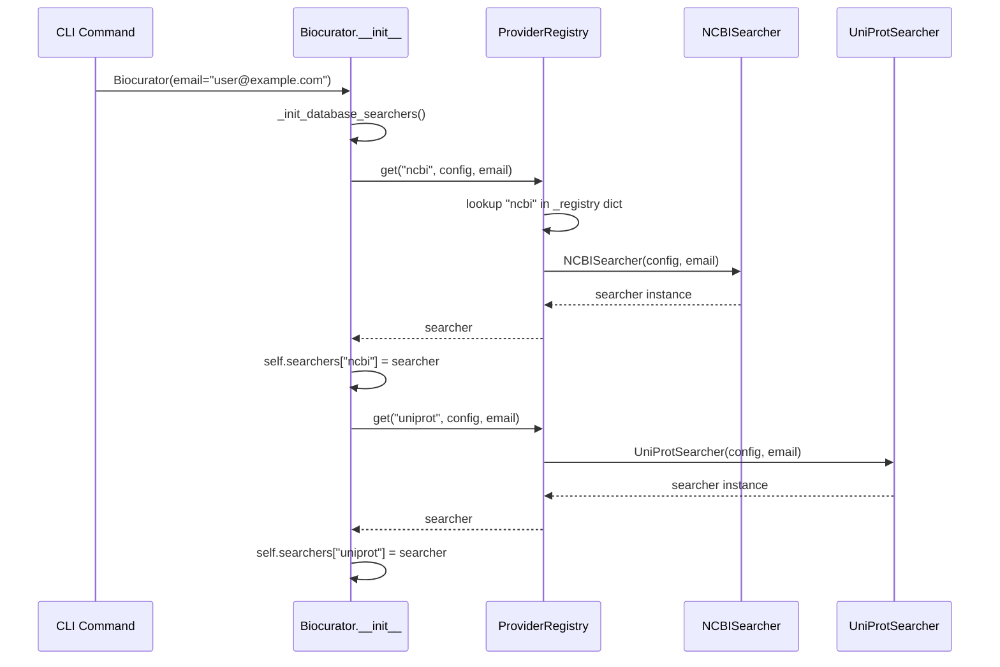

# Architecture

**Analysis Date:** 2026-05-25

## Pattern Overview

**Overall:** Layered architecture with Plugin/Provider-based extension model

**Key Characteristics:**
- **Config-driven pipeline**: YAML config defines one or more jobs, each with search → filter → export phases
- **Streaming pipeline**: Data flows through generators (`Iterator[SequenceRecord]`) to support memory-efficient curation of large datasets
- **Strategy pattern via QueryBuilder**: Per-database query builders implement a common `QueryBuilder[T]` interface with provider-specific logic
- **Abstract Provider pattern**: `DatabaseSearcher` ABC defines the contract for all database providers; concrete implementations handle NCBI Entrez and UniProt REST APIs
- **Registry pattern**: `ProviderRegistry` is a static registry for discovering and instantiating database searcher implementations
- **Exponential backoff retry**: Decorator-based `@retry` wraps all network calls for resilience against transient failures

## Layers

### CLI Layer
- Purpose: User-facing command-line interface using Typer + Rich
- Location: `src/biocurator/cli/`
- Contains: `main.py` (app definition), `commands/` subdirectory with `init.py`, `run.py`, `preview.py`
- Depends on: `config.loader`, `core.curator`, `providers`, `utils.logging`
- Used by: End users via `biocurator` CLI command (entry point in `pyproject.toml`)

### Config Layer
- Purpose: YAML config parsing, validation, and typed dataclass schema
- Location: `src/biocurator/config/`
- Contains: `schema.py` (dataclasses: `SearchConfig`, `FilterConfig`, `ExportConfig`, `JobConfig`, `GlobalConfig`), `loader.py` (`ConfigLoader`)
- Depends on: PyYAML, `exceptions`
- Used by: CLI commands, `core.curator`

### Core Layer
- Purpose: Orchestration of curation pipeline — search, filter, download, export
- Location: `src/biocurator/core/`
- Contains: `curator.py` (`Biocurator`), `filters.py` (`SequenceFilter`), `exporter.py` (`StreamingExporter`)
- Depends on: `providers` (registry, searchers, criteria, base types), `utils.logging`
- Used by: CLI commands

### Provider Layer
- Purpose: Abstract interface + concrete implementations for biological database access
- Location: `src/biocurator/providers/`
- Contains:
  - `base.py` — Abstract classes: `DatabaseSearcher[C]`, `QueryBuilder[T]`; Value objects: `SearchCriteria`, `DatabaseConfig`, `SequenceRecord`, `NCBIDatabase` (StrEnum with 39 database identifiers)
  - `registry.py` — `ProviderRegistry` (static class-level registry with `register()`, `get()`, `available()`)
  - `ncbi/` — `NCBISearcher`, `NCBISearchCriteria`, 5 `QueryBuilder` implementations (`SequenceQueryBuilder`, `LiteratureQueryBuilder`, `GeneQueryBuilder`, `SRAQueryBuilder`, `TaxonomyQueryBuilder`)
  - `uniprot/` — `UniProtSearcher`, `UniProtSearchCriteria`, `UniProtQueryBuilder`
- Depends on: `utils.logging`, `utils.network` (retry), Biopython (`Bio.Entrez`, `Bio.SeqIO`), `requests`
- Used by: `core.curator`, CLI `preview` command

### Utility Layer
- Purpose: Shared logging, network retry, and decorator utilities
- Location: `src/biocurator/utils/`
- Contains: `logging.py` (get_logger, PerformanceLogger, log_function_call, enable_verbose_logging), `network.py` (retry decorator with exponential backoff)
- Depends on: Python stdlib only
- Used by: All layers

### Exception Layer
- Purpose: Typed exception hierarchy
- Location: `src/biocurator/exceptions.py`
- Contains: `BiocuratorError` (base), `ConfigNotFoundError`, `InvalidConfigError`, `JobNotFoundError`, `DatabaseSearchError`, `DownloadError`, `ExportError`
- Used by: CLI layer, config layer, core layer

## Data Flow

### Full Job Execution Flow

1. **CLI (`cli/commands/run.py`)**:
   - User runs `biocurator run config.yaml`
   - `ConfigLoader.load(path)` parses YAML into `GlobalConfig` (typed dataclass tree)
   - Optionally filters jobs by `--jobs` flag
   - Instantiates `Biocurator` with `email` from config
   - Iterates selected jobs, calls `curator.run_job(job_config, progress_callback)`

2. **Orchestration (`core/curator.py` → `Biocurator.run_job()`)**:
   - Entry point for single-job execution
   - Context manager opens `StreamingExporter` (FASTA/CSV/JSON file handles)
   - For each database listed in `job.search.databases`:
     - Retrieves searcher from `self.searchers` dict (populated at init)
     - Constructs provider-specific `SearchCriteria` (`NCBISearchCriteria` or `UniProtSearchCriteria`)

3. **Search Phase**:
   - `searcher.search(criteria)` → queries remote API via Entrez or UniProt REST
   - Returns `list[str]` of record IDs (accessions)
   - NCBI uses `Entrez.esearch` with `usehistory="y"` to enable WebEnv for subsequent batch fetches
   - UniProt uses `/uniprotkb/search` endpoint with TSV format

4. **Metadata Filter Phase**:
   - `searcher.fetch_metadata(ids, criteria)` → yields `Iterator[SequenceRecord]`
   - Each `SequenceRecord` passes through `SequenceFilter.filter_by_criteria()`:
     - Length filters (`min_length`, `max_length`)
     - Organism matching
     - Exclude term matching (title/description)
     - Quality threshold is **deferred** to download phase (only applied when sequence is available)
     - Date range filtering
     - Taxonomy filtering
   - Filtered IDs collected into `filtered_metadata_ids`

5. **Download Phase**:
   - `searcher.download(filtered_metadata_ids, outdir, criteria)` → yields `Iterator[SequenceRecord]`
   - Each record has `sequence` populated, `downloaded=True`
   - NCBI: `Entrez.efetch` with `rettype="fasta"`, uses history server for efficient retrieval, one-at-a-time streaming
   - UniProt: HTTP GET to `/uniprotkb/{uid}.fasta`, each parsed with `SeqIO.read`
   - Quality filter applied to downloaded sequence (N/X content scoring) if `quality_threshold` set
   - Each passing record written immediately via `exporter.write_record(seq_record)`

6. **Export Phase**:
   - `StreamingExporter` (context manager) writes incrementally:
     - FASTA: header line (`>accession description`) + sequence lines
     - CSV: `pandas.DataFrame.to_csv()` appended for each record (header written once)
     - JSON: array of `vars(record)` appended with comma separators, `]` written on close
   - Returns `dict[str, Path]` mapping format names to output file paths

7. **CLI Output**:
   - Progress bars updated via `progress_callback(phase, current, total)`
   - Summary table rendered with Rich `Table` showing per-job status/files

### Preview Flow

- `biocurator preview <job_name> --config config.yaml`
- Same config loading + Biocurator init as run
- For each database: search + fetch_metadata only (max 10 results)
- Renders Rich Table with accession, title, organism, length
- No filtering or download

## Data Architecture

### Key Abstractions

**`SearchCriteria` (dataclass)** — `src/biocurator/providers/base.py`
- Base value object for search parameters
- Fields: `organism`, `keywords`, `min_length`, `max_length`, `start_date`, `end_date`, `max_results`, `exclude_terms`, `quality_threshold`
- Subclassed by:
  - `NCBISearchCriteria` — adds `database: NCBIDatabase`, `taxonomy_filter`, `location`, `webenv`, `query_key`
  - `UniProtSearchCriteria` — adds `reviewed: bool | None`

**`SequenceRecord` (dataclass)** — `src/biocurator/providers/base.py`
- Universal data transfer object across all providers
- Fields: `id`, `accession`, `database`, `title`, `organism`, `sequence_length`, `sequence`, `description`, `create_date`, `update_date`, `taxonomy_id`, `authors`, `journal`, `downloaded`, `quality_score`

**`DatabaseSearcher[C]` (ABC)** — `src/biocurator/providers/base.py`
- Generic abstract searcher parameterized by criteria type `C`
- Methods: `build_query()`, `search()`, `fetch_metadata()`, `download()`
- All methods return/accept `SequenceRecord` for provider-agnostic data exchange

**`QueryBuilder[T]` (ABC)** — `src/biocurator/providers/base.py`
- Generic strategy interface for query string construction
- Methods: `build(criteria: T) -> str`, `available_fields() -> dict[str, str]`
- Implementations: `SequenceQueryBuilder`, `LiteratureQueryBuilder`, `GeneQueryBuilder`, `SRAQueryBuilder`, `TaxonomyQueryBuilder`, `UniProtQueryBuilder`

**`DatabaseConfig` (dataclass)** — `src/biocurator/providers/base.py`
- Configuration for a database connection
- Fields: `name`, `base_url`, `api_key`, `rate_limit`, `batch_size`, `timeout`

### Provider Architecture

```mermaid
graph TB
    subgraph "Provider Abstraction"
        DS[DatabaseSearcher[C]{{abstract}}]
        QB[QueryBuilder[T]{{abstract}}]
        SC[SearchCriteria]
        SR[SequenceRecord]
        DC[DatabaseConfig]
    end

    subgraph "NCBI Provider"
        NCS[NCBISearcher]
        NCSC[NCBISearchCriteria]
        subgraph "Query Builders"
            SQB[SequenceQueryBuilder]
            LQB[LiteratureQueryBuilder]
            GQB[GeneQueryBuilder]
            SRQB[SRAQueryBuilder]
            TQB[TaxonomyQueryBuilder]
        end
        GF[get_builder{{factory}}]
    end

    subgraph "UniProt Provider"
        UPS[UniProtSearcher]
        UPSC[UniProtSearchCriteria]
        UPQB[UniProtQueryBuilder]
    end

    subgraph "Registry"
        PR[ProviderRegistry]
    end

    DS -->|inherited by| NCS
    DS -->|inherited by| UPS
    QB -->|inherited by| SQB
    QB -->|inherited by| LQB
    QB -->|inherited by| GQB
    QB -->|inherited by| SRQB
    QB -->|inherited by| TQB
    QB -->|inherited by| UPQB
    SC -->|extended by| NCSC
    SC -->|extended by| UPSC
    NCS -->|registers| PR
    UPS -->|registers| PR
    GF -->|returns| SQB
    GF -->|returns| LQB
    GF -->|returns| GQB
    GF -->|returns| SRQB
    GF -->|returns| TQB
```

### Module Dependency Graph

```mermaid
graph TD
    subgraph "CLI"
        CLI[cli/main.py]
        RUN[cli/commands/run.py]
        PREV[cli/commands/preview.py]
        INIT[cli/commands/init.py]
    end

    subgraph "Core"
        CUR[core/curator.py]
        FILT[core/filters.py]
        EXP[core/exporter.py]
    end

    subgraph "Config"
        SCHEMA[config/schema.py]
        LOAD[config/loader.py]
    end

    subgraph "Providers"
        BASE[providers/base.py]
        REG[providers/registry.py]
        NCBI[providers/ncbi/]
        UNI[providers/uniprot/]
    end

    subgraph "Utils"
        LOG[utils/logging.py]
        NET[utils/network.py]
    end

    subgraph "Exceptions"
        EXC[exceptions.py]
    end

    CLI --> RUN
    CLI --> PREV
    CLI --> INIT
    CLI --> LOG

    RUN --> LOAD
    RUN --> CUR
    RUN --> LOG
    
    PREV --> LOAD
    PREV --> CUR
    PREV --> BASE

    CUR --> REG
    CUR --> BASE
    CUR --> NCBI
    CUR --> UNI
    CUR --> FILT
    CUR --> EXP
    CUR --> LOG

    LOAD --> SCHEMA
    LOAD --> EXC

    NCBI --> BASE
    NCBI --> REG
    UNI --> BASE
    UNI --> REG

    REG --> BASE

    NCBI --> LOG
    NCBI --> NET
    UNI --> LOG
    UNI --> NET

    FILT --> BASE
    FILT --> LOG

    EXP --> BASE
    EXP --> LOG
```

## Configuration Architecture

**Config file format:** YAML (loaded via PyYAML)

**Schema hierarchy** (`src/biocurator/config/schema.py`):
```
GlobalConfig
├── email: str (required — used for NCBI Entrez API identification)
└── jobs: list[JobConfig]
    ├── name: str (derived from YAML key)
    ├── search: SearchConfig
    │   ├── databases: list[str] (required — e.g., ["ncbi", "uniprot"])
    │   ├── organism: str | None
    │   ├── sequence_type: str (default: "nucleotide")
    │   ├── keywords: list[str]
    │   ├── max_results: int (default: 100)
    │   ├── date_range: dict | None ({start: ..., end: ...})
    │   ├── exclude_terms: list[str]
    │   ├── location: str | None
    │   └── taxonomy_filter: str | None
    ├── filter: FilterConfig
    │   ├── min_length: int | None
    │   ├── max_length: int | None
    │   ├── exclude_terms: list[str]
    │   └── quality_threshold: float | None
    └── export: ExportConfig
        ├── outdir: str (default: "results")
        ├── formats: list[str] (default: ["fasta"])
        └── prefix: str (default: "biocurator")
```

**Config loading** (`src/biocurator/config/loader.py`):
- `ConfigLoader.load(path)` — static method, reads YAML, validates, returns `GlobalConfig`
- Side-loaded via `main.py` (programmatic API) or CLI config argument
- `ConfigLoader._parse()` and `_parse_job()` handle nested YAML → typed dataclass conversion
- Missing `email` or `search.databases` raises `InvalidConfigError`

## CLI Command Hierarchy

```
biocurator
├── --debug          Enable verbose logging
├── --version        Show version and exit
├── init [OPTIONS]
│   ├── -o, --output PATH    Write to file instead of stdout
│   └── -t, --template TEXT  "basic" (default) or "advanced"
├── run CONFIG [OPTIONS]
│   ├── CONFIG               Path to YAML config (required positional arg)
│   ├── -j, --jobs TEXT      Comma-separated job names
│   ├── --dry-run            Validate + preview without downloading
│   └── -v, --verbose        Timestamped log output
└── preview JOB_NAME [OPTIONS]
    ├── JOB_NAME             Job name to preview (required positional arg)
    └── -c, --config PATH    Path to YAML config (default: "config.yaml")
```

## Seacher Initialization Flow



Searchers are registered at module import time via:
- `src/biocurator/providers/ncbi/searcher.py` line 167: `ProviderRegistry.register("ncbi", NCBISearcher)`
- `src/biocurator/providers/uniprot/searcher.py` line 112: `ProviderRegistry.register("uniprot", UniProtSearcher)`

## Design Patterns

| Pattern | Where | Usage |
|---|---|---|
| **Strategy** | `QueryBuilder[T]` implementations | Different query string construction algorithms per database type, selected at runtime via `get_builder()` factory |
| **Factory** | `get_builder(db: NCBIDatabase)` in `providers/ncbi/query_builders.py` | Returns correct `QueryBuilder` for a given NCBI database via `_BUILDER_MAP` lookup |
| **Registry** | `ProviderRegistry` in `providers/registry.py` | Static registry for discovering and instantiating `DatabaseSearcher` implementations by name string |
| **Template Method** | `DatabaseSearcher[C]` ABC | Defines skeleton `search()`, `fetch_metadata()`, `download()` contract; subclasses fill in implementation details |
| **Abstract Factory** | `Biocurator._init_database_searchers()` | Uses `ProviderRegistry.get()` to create concrete searcher instances based on config |
| **Context Manager** | `StreamingExporter` | `__enter__`/`__exit__` for safe file handle lifecycle (open on enter, close with JSON finalization on exit) |
| **Generator/Iterator** | All `fetch_metadata()` and `download()` methods | Streaming memory-efficient data processing via `yield` |
| **Decorator** | `@retry` in `utils/network.py`, `@log_function_call` in `utils/logging.py` | Cross-cutting concerns (retry logic, performance logging) applied via decorators |
| **Null Object / Defaults** | Config dataclasses with `None` defaults | Unset fields gracefully degrade; `SequenceFilter.filter_by_criteria()` handles missing values with conditionals |
| **Callback** | `progress_callback` parameter in `Biocurator.run_job()` | Non-invasive progress reporting decouples pipeline from UI |

## Error Handling

**Strategy:** Typed exception hierarchy with CLI-level catch-and-report

**Patterns:**
- `BiocuratorError` base class for all project exceptions (`src/biocurator/exceptions.py`)
- Specific subtypes: `ConfigNotFoundError`, `InvalidConfigError`, `JobNotFoundError`, `DatabaseSearchError`, `DownloadError`, `ExportError`
- CLI catches known exceptions (`ConfigNotFoundError`, `InvalidConfigError`) and reports via Rich console with red styling
- `JobNotFoundError` is raised when `--jobs` references unknown job names
- Network-level errors are handled by the `@retry` decorator (exponential backoff, configurable attempts/delay/jitter)
- Per-record download failures are logged as warnings and **skipped** — individual failures don't stop the batch
- `InvalidConfigError` contains descriptive messages about what field/format is wrong

## Streaming Architecture

The entire curation pipeline is designed for streaming to handle large datasets:

1. **Search** returns IDs only (small, memory-efficient)
2. **Metadata** is fetched in batches and yielded as records via generator
3. **Filter** operates on individual records as they stream through
4. **Download** fetches sequences one-at-a-time via generator
5. **Export** writes each record to disk immediately via `StreamingExporter.write_record()`

This means only one sequence is held in memory at a time during the download+export phase, regardless of total dataset size.

## Cross-Cutting Concerns

**Logging:** `biocurator.utils.logging` — hierarchical logger under `biocurator.*` namespace, `PerformanceLogger` for timing, `_SensitiveFilter` to redact credentials, `log_function_call` decorator, `enable_verbose_logging()` to attach RichHandler or StreamHandler

**Validation:** Config validation happens at load time (`ConfigLoader._parse()`) — checks for required `email` and `search.databases` fields. Dataclass defaults handle optional fields.

**Authentication:** NCBI Entrez uses `email` (required) and optional `api_key` from `DatabaseConfig`. UniProt requires no authentication.

**Rate Limiting:** Each searcher has a configurable `rate_limit` (seconds between requests) in `DatabaseConfig`. NCBI defaults to 0.3s (~3 req/s), UniProt to 0.5s (~2 req/s).

## Adding a New Provider

1. Define a criteria subclass: `class MyDBSearchCriteria(SearchCriteria): ...`
2. Implement `QueryBuilder[MyDBSearchCriteria]` with `build()` and `available_fields()`
3. Implement `DatabaseSearcher[MyDBSearchCriteria]` with `search()`, `fetch_metadata()`, `download()`
4. Register: `ProviderRegistry.register("mydb", MyDBSearcher)` (at module import time)
5. Add `"mydb"` to `SearchConfig.databases` valid values in config schema/docs

---

*Architecture analysis: 2026-05-25*
