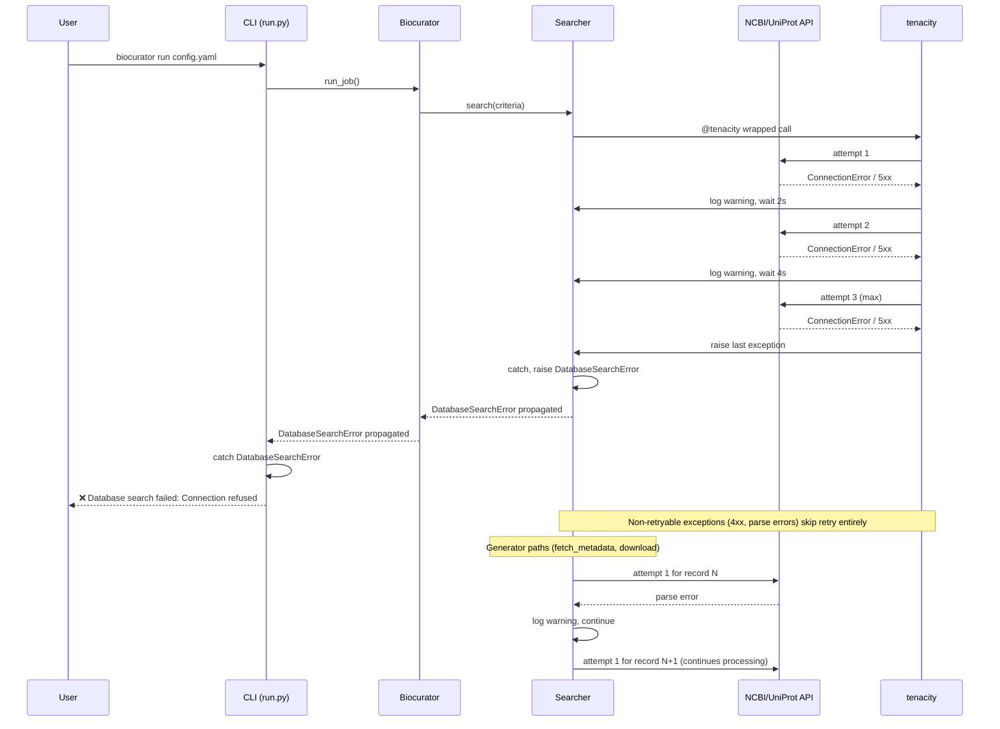

# Phase 1: Error Handling & Retry Foundation — Research

**Researched:** 2026-05-25
**Domain:** Python error handling, retry strategies, exception classification, config-driven reliability
**Confidence:** HIGH

## Summary

This phase fixes the two root-cause reliability issues in the existing curation pipeline: (1) API exceptions in `search()` methods are silently caught with `except Exception: return []`, so users never know when NCBI or UniProt searches fail; (2) the custom `@retry` decorator in `utils/network.py` has no configurability, no backoff timing in logs, and catches `Exception` broadly — making it unsuitable for distinguishing transient network errors from permanent data errors.

The solution replaces the custom `@retry` with **tenacity 9.1.4**, a battle-tested retry library with composable stop/wait/retry strategies. Each of the 3 call sites (`NCBISearcher._safe_entrez_call`, `UniProtSearcher._safe_get`, and the inline `_fetch()` in NCBI `download`) gets a tenacity decorator configured from a `RetryConfig` dataclass. The config schema gains optional `retry` blocks (global defaults + per-database overrides), all with zero backward compatibility impact.

**Primary recommendation:** Replace custom `@retry` with tenacity decorators configured via `RetryConfig` dataclass, narrow exception handling to distinguish retryable network errors from non-retryable data errors, and surface typed `DatabaseSearchError` from `search()` methods instead of silent `[]` returns.

## Architectural Responsibility Map

| Capability | Primary Tier | Secondary Tier | Rationale |
|------------|-------------|----------------|-----------|
| Retry strategy configuration | Config (dataclass) | — | `RetryConfig` lives in `config/schema.py`, parsed during config load |
| Retry decorator application | Provider layer | — | `.searcher.py` files own the 3 decorator call sites |
| Typed exception raising | Provider layer | — | `search()` raises `DatabaseSearchError`; generators log warnings |
| CLI error surfacing | CLI handler | — | `run.py` catches typed errors, shows Rich error, exits |
| Logging retry attempts | tenacity `before_sleep_log` | — | Logging is a cross-cutting concern configured at decorator creation |
| Merge logic (defaults → overrides) | Config schema | Provider init | `Biocurator._init_database_searchers()` passes merged `config` to searchers |

## User Constraints

> Copied verbatim from CONTEXT.md — planner MUST honor these.

<user_constraints>
### Locked Decisions

1. **Error Surface Behavior:**
   - Generators (fetch_metadata, download): Collect errors per-record, log warning, continue with remaining records. Report failure summary at end. Never silently skip.
   - search() methods: Raise typed exception (DatabaseSearchError) instead of returning []. Let the error propagate to the CLI handler for clear user feedback.
   - Rationale: Fail-fast in search (a failed search means zero results — no point continuing). Collect-and-continue in batch operations (partial results are useful; don't throw away 99 good records because 1 failed).

2. **Exception Classification:**
   - Retryable (tenacity): Only network-level exceptions
   - Non-retryable (fail immediately): Parse/data errors

3. **Migration Strategy:**
   - Full replacement: remove the custom @retry decorator from utils/network.py entirely. Replace all 3 call sites with tenacity decorators using consistent, configured parameters.

4. **Config Structure:**
   - Global defaults at top level of YAML + per-database overrides inside job search config
   - Fields (user-friendly names): max_attempts, backoff_factor, max_delay, timeout

5. **Field Naming:**
   - User-friendly names in config YAML. Map to tenacity internally.

### the agent's Discretion
   - Where exactly RetryConfig lives (dedicated file vs. schema.py vs. base.py)
   - Whether `utils/network.py` is completely removed or kept with just the dataclass
   - How to construct per-searcher RetryConfig from merged config at init time

### Deferred Ideas (OUT OF SCOPE)
   - Circuit breaker pattern (Phase 2)
   - Persistent circuit breaker state across restarts (V2-01)
</user_constraints>

## Phase Requirements

| ID | Description | Research Support |
|----|-------------|------------------|
| ERR-01 | Fix silent error swallowing in NCBISearcher/UniProtSearcher — propagate errors, never `return []` | Typed exceptions section; existing `DatabaseSearchError` class; 3 call sites identified |
| ERR-02 | Narrow caught exceptions from `Exception` to `requests.RequestException` and domain-specific types | Exception classification tables; retryable vs non-retryable per provider |
| ERR-03 | Replace custom `@retry` with tenacity for configurable, per-provider retry strategies | Tenacity API patterns; 3 call site migration; `RetryConfig` dataclass design |
| ERR-04 | Add retry config to `DatabaseConfig` — max_attempts, backoff_factor, max_delay, timeout | RetryConfig dataclass with merge strategy; config schema changes |
| CFG-01 | Add retry fields to DatabaseConfig schema — all optional with defaults | Backward compatibility analysis; pyyaml safe_load ignores unknown keys |
| CFG-02 | Ensure backward compatibility — existing YAML configs without new fields must parse without error | Verified: PyYAML safe_load ignores unknown keys; optional dataclass fields with defaults |

## Standard Stack

### Core

| Library | Version | Purpose | Why Standard |
|---------|---------|---------|--------------|
| tenacity | 9.1.4 | Configurable retry with exponential backoff, logging hooks, composable strategies | The de facto Python retry library; replaces 80-line custom implementation with 20+ composable primitives; actively maintained (2026-02-07 release) |

[VERIFIED: PyPI — tenacity 9.1.4 released 2026-02-07]

### Supporting

| Library | Version | Purpose | When to Use |
|---------|---------|---------|-------------|
| requests | 2.34.2 (resolved) | HTTP client — exception types for retry classification | All UniProt API calls |
| biopython | 1.87 (resolved) | NCBI Entrez wrapper — exception types for retry classification | All NCBI API calls via `Bio.Entrez` |

### Alternatives Considered

| Instead of | Could Use | Tradeoff |
|------------|-----------|----------|
| tenacity | `stamina` | stamina is a thin wrapper around tenacity with type-safe defaults; if project needs more control (custom retry predicates, raw `Retrying` API), tenacity is better |
| tenacity | `backoff` | Backoff is simpler but lacks `before_sleep` logging hooks, retry-on-result, and composable stop/wait strategies |
| tenacity | Keep custom `@retry` | Would need to add logging, config injection, exception narrowing ourselves — reimplementing a battle-tested library |

**Installation:**
```bash
uv add tenacity>=9.1,<10.0
```

**Version verification (2026-05-25):**
```bash
npm view tenacity version
# → 9.1.4  (published 2026-02-07)
```

## Architecture Patterns

### System Architecture Diagram

```mermaid
flowchart TD
    subgraph "YAML Config"
        C[config.yaml]
    end

    subgraph "Config Layer"
        CL[ConfigLoader]
        S[Schema dataclasses:\nGlobalConfig / SearchConfig]
        RC[RetryConfig\nmax_attempts, backoff_factor,\nmax_delay, timeout]
    end

    subgraph "Core Layer"
        BC[Biocurator]
        subgraph "Init Flow"
            Merge[Merge retry config:\nglobal defaults →\nper-database overrides]
            Build[Build DatabaseConfig\nwith merged retry settings]
        end
    end

    subgraph "Provider Layer"
        direction LR
        subgraph "NCBI"
            NCBI_ENTREZ[safe_entrez_call\n@tenacity decorated]
            NCBI_FETCH[download / _fetch\n@tenacity decorated]
        end
        subgraph "UniProt"
            UNI_GET[safe_get\n@tenacity decorated]
        end
    end

    subgraph "Error Handling"
        ERR{Exception type?}
        NET[Network error:\nConnectionError, Timeout,\n5xx, URLError]
        DATA[Data/parse error:\nValueError, KeyError,\n4xx, XML parse error]
        RETRY[tenacity retry\n(exponential backoff)]
        FAIL[Raise immediately]
        SURFACE[CLI prints:\nred error message,\ntyper.Exit(1)]
    end

    C --> CL
    CL --> S
    S -- "retry: dict" --> RC

    BC --> Merge
    Merge --> Build
    Build -- "config with .retry" --> NCBI_ENTREZ
    Build -- "config with .retry" --> NCBI_FETCH
    Build -- "config with .retry" --> UNI_GET

    NCBI_ENTREZ --> ERR
    NCBI_FETCH --> ERR
    UNI_GET --> ERR

    ERR -- retryable --> RETRY
    ERR -- non-retryable --> FAIL
    
    search() --> FAIL
    FAIL --> SURFACE
    fetch_metadata/download -- non-retryable --> WARN[Log warning,\ncontinue batch]
```

### Data Flow for Error Cases



### RetryConfig Merge Strategy (Priority Chain)

```
JobConfig.search.retry.ncbi (highest priority)
       ↓ overrides
GlobalConfig.retry.ncbi  (if per-database globals were defined)
       ↓ overrides
GlobalConfig.retry (top-level global defaults)
       ↓ overrides
tenacity built-in defaults (stop_after_attempt=never, wait=None — DANGER)
```

**Implementation:** The merge happens at `Biocurator._init_database_searchers()` time: the global `RetryConfig` is the base, job-level per-database overrides (if any) are merged on top, and the resulting merged `RetryConfig` is passed into `DatabaseConfig.retry` when constructing the provider searcher.

### Config Schema Changes

**Before (GlobalConfig):**
```python
@dataclass
class GlobalConfig:
    email: str
    jobs: list[JobConfig]
```

**After:**
```python
@dataclass
class GlobalConfig:
    email: str
    jobs: list[JobConfig]
    retry: RetryConfig | None = None  # NEW — global defaults
```

**Before (DatabaseConfig):**
```python
@dataclass
class DatabaseConfig:
    name: str
    base_url: str | None = None
    api_key: str | None = None
    rate_limit: float = 0.3
    batch_size: int = 20
    timeout: int = 30
```

**After:**
```python
@dataclass
class DatabaseConfig:
    name: str
    base_url: str | None = None
    api_key: str | None = None
    rate_limit: float = 0.3
    batch_size: int = 20
    timeout: int = 30
    retry: RetryConfig | None = None  # NEW — per-provider merged retry config
```

**SearchConfig** gets a `retry: dict[str, RetryConfig] | None = None` field for per-database overrides at job level.

### Recommended Project Structure (new/changed files)

```
src/biocurator/
├── config/
│   ├── schema.py          # MODIFIED — add RetryConfig, add retry to GlobalConfig/SearchConfig
│   ├── loader.py          # MODIFIED — parse retry blocks from YAML
│   └── retry_config.py    # NEW — RetryConfig dataclass + merge logic (optional, could live in schema.py)
├── providers/
│   ├── base.py            # MODIFIED — add retry to DatabaseConfig
│   ├── ncbi/
│   │   └── searcher.py    # MODIFIED — tenacity decorators, narrow exception handlers
│   └── uniprot/
│       └── searcher.py    # MODIFIED — tenacity decorators, narrow exception handlers
├── utils/
│   └── network.py         # REMOVED or gutted (move RetryConfig if kept there)
└── exceptions.py          # MODIFIED — add DatabaseConnectionError, ParseError if needed
```

### Anti-Patterns to Avoid

- **Catching `Exception` in searchers:** The root cause of ERR-01. Always narrow to specific exception types.
- **Returning `[]` from search on failure:** Hides failures. Raise typed exceptions instead.
- **Retrying 4xx errors:** Server-side validation/data errors will never succeed on retry. Only retry 5xx (server fault) and network errors.
- **Using tenacity defaults:** Default stop is `stop_never` (infinite retries), default wait is `wait_none` (no delay). Always configure both `stop` and `wait`.

## Don't Hand-Roll

| Problem | Don't Build | Use Instead | Why |
|---------|-------------|-------------|-----|
| Retry with exponential backoff | Custom decorator | tenacity 9.1.4 | 20+ composable strategies, logging hooks, exception filtering, jitter, `retry_with()` for runtime override — all tested at scale |
| Dynamic retry config from runtime | Custom wrapper that reads config | Use `Retrying` class directly or `retry_with()` | tenacity already provides `Retrying(stop=stop_after_attempt(n), ...)` for dynamic creation at call time |

**Key insight:** The existing 80-line `@retry` decorator is a textbook example of a "don't hand-roll" case — it lacks exception narrowing, configurable backoff logging, jitter transparency, and composability. tenacity provides all of these with battle-tested correctness.

## Runtime State Inventory

> This is a code-only phase (no rename/refactor/migration of existing strings). No runtime state inventory needed.

Step 2.6: SKIPPED (no external dependencies beyond Python packages; no database, service, or OS registrations affected).

## Common Pitfalls

### Pitfall 1: Forgetting tenacity's default behavior
**What goes wrong:** `@retry` without `stop=` or `wait=` will retry forever with zero delay. This can cause rapid-fire API calls that overwhelm the server and get the user's IP rate-limited or banned.
**Why it happens:** tenacity's defaults are designed for maximum flexibility, not production safety.
**How to avoid:** Always configure both `stop=stop_after_attempt(N)` and `wait=wait_exponential(...)`.
**Warning signs:** Tests hang forever when you forget to mock tenacity. API servers return 429/503 rapidly.

### Pitfall 2: Decorating generator functions with `@retry`
**What goes wrong:** `@retry` only retries the *function call*, not the *iteration*. For generator functions, the function call just returns a generator object — exceptions raised during `for record in gen:` are NOT retried by the decorator.
**Why it happens:** The existing code already has this pattern right — the retry-worthy call is `Entrez.efetch()` inside a helper `_fetch()` function, not the generator itself.
**How to avoid:** Keep the pattern of wrapping the individual API call (not the generator) in the retry. Do NOT decorate `fetch_metadata()` or `download()` with `@retry`.
**Code search:** We verified both `_safe_entrez_call` and `_safe_get` are regular functions returning a value, not generators. The inline `_fetch()` in `download()` is also a non-generator closure. ✅

### Pitfall 3: `before_sleep` logging with `exc_info=True` after success
**What goes wrong:** `before_sleep_log` automatically looks at `retry_state.outcome` for exception info. After a successful call, `outcome.exception()` returns `None`, which is harmless. After a failed call, the exception is available.
**Why it happens:** Design of tenacity — `before_sleep` is always called after a failed attempt that will be retried. It's never called after a successful call, so the exception is always non-None.
**How to avoid:** Use `before_sleep_log(logger, logging.WARNING)` — it works correctly for the retry-failure scenario. No need for conditional logic.

### Pitfall 4: Raising `DatabaseSearchError` in `search()` breaks `run_job` flow
**What goes wrong:** Currently `run_job()` does `if not ids: continue` after `search()`. If `search()` raises instead of returning `[]`, this guard becomes dead code. The exception propagates up to `run_job()`'s try/except in CLI, which marks the job as failed.
**Why this is correct per CONTEXT.md:** The design decision is explicit — fail-fast on search. The CLI already catches `Exception` around `run_job()` and marks the job as failed. The guard `if not ids: continue` becomes an anti-pattern but will be handled when the error propagates.
**How to handle:** The `if not ids: continue` guard in `run_job()` line 124 becomes unreachable for error cases but isn't harmful — it still handles the normal "zero results, search succeeded" case. Remove it only if it confuses static analysis.

### Pitfall 5: Biopython Entrez.read() raises during parse, not during HTTP call
**What goes wrong:** `_safe_entrez_call` currently calls `func(**kwargs)` (the HTTP call) then `Entrez.read(handle)` (the XML parse). A parse error is non-retryable but happens inside the retry-decorated function.
**Why it happens:** `Entrez.read()` is inside the `@retry`-wrapped function, so parse errors get retried too.
**How to fix:** Split the call: wrap only `Entrez.efetch(**kwargs)` / `Entrez.esearch(**kwargs)` etc. in retry, and call `Entrez.read(handle)` separately outside the decorator. Or keep both inside but add a custom retry predicate that only retries network errors.

## Code Examples

### tenacity Decorator with Configurable RetryConfig

```python
# Source: tenacity official docs (https://tenacity.readthedocs.io/en/latest/)
# This is the recommended pattern for this phase.

from tenacity import (
    retry,
    stop_after_attempt,
    wait_exponential,
    retry_if_exception_type,
    before_sleep_log,
)

# Construct tenacity params from a RetryConfig dataclass
def _make_retry_decorator(
    retry_cfg: RetryConfig,
    logger: logging.Logger,
) -> Any:
    """Build a tenacity retry decorator from configuration.
    
    Returns a fully-configured @retry decorator.
    """
    return retry(
        stop=stop_after_attempt(retry_cfg.max_attempts),
        wait=wait_exponential(
            multiplier=retry_cfg.backoff_factor,
            max=retry_cfg.max_delay,
        ),
        retry=retry_if_exception_type(RETRYABLE_EXCEPTIONS),
        reraise=True,
        before_sleep=before_sleep_log(logger, logging.WARNING),
    )
```

### Using tenacity with `retry_with()` for Runtime Config Override

```python
# Source: tenacity official docs (https://tenacity.readthedocs.io/en/latest/#changing-arguments-at-run-time)
# Alternative pattern: set default, override at call site

from tenacity import retry, stop_after_attempt, wait_exponential

@retry(
    stop=stop_after_attempt(3),
    wait=wait_exponential(multiplier=2.0, max=60),
    retry=retry_if_exception_type(RETRYABLE_EXCEPTIONS),
    reraise=True,
)
def _safe_entrez_call(self, func, **kwargs):
    """Execute an Entrez call with retry logic."""
    handle = func(**kwargs)
    # Parse happens OUTSIDE the retry — if it fails, no retry
    result = Entrez.read(handle)
    handle.close()
    return result

# In __init__, override retry params from config:
self._safe_entrez_call = _safe_entrez_call.retry_with(
    stop=stop_after_attempt(config.retry.max_attempts),
    wait=wait_exponential(
        multiplier=config.retry.backoff_factor,
        max=config.retry.max_delay,
    ),
)
```

### Using `Retrying` Directly (No Decorator)

```python
# Source: tenacity official docs — for dynamic config from runtime variables

from tenacity import Retrying, stop_after_attempt, wait_exponential

def _safe_get(self, url, **kwargs):
    """Retry a GET request with configurable tenacity Retrying."""
    retryer = Retrying(
        stop=stop_after_attempt(self.config.retry.max_attempts),
        wait=wait_exponential(
            multiplier=self.config.retry.backoff_factor,
            max=self.config.retry.max_delay,
        ),
        retry=retry_if_exception_type(RETRYABLE_EXCEPTIONS),
        reraise=True,
        before_sleep=before_sleep_log(logger, logging.WARNING),
    )
    return retryer(self.session.get, url, **kwargs)
```

### NCBI `_safe_entrez_call` After Migration — Split Parse from Network Call

```python
# The key change: Entrez.read() is NOT inside the tenacity decorator
# because XML parse errors are not retryable.

def search(self, criteria: NCBISearchCriteria) -> list[str]:
    logger.info(f"Searching NCBI {criteria.database} database...")
    query = self.build_query(criteria)
    logger.info(f"Search query: {query}")
    try:
        handle = self._safe_entrez_call(
            Entrez.esearch,
            db=criteria.database,
            term=query,
            retmax=criteria.max_results,
            sort="relevance",
            usehistory="y",
        )
        # Parse OUTSIDE the retry — parse errors fail immediately
        results = Entrez.read(handle)
        handle.close()

        ids = results.get("IdList", [])
        criteria.webenv = results.get("WebEnv")
        criteria.query_key = results.get("QueryKey")
        logger.info(f"Found {len(ids)} potential sequences (History Server active)")
        return ids
    except DatabaseSearchError:
        raise  # Already a typed error — let it propagate
    except RETRYABLE_EXCEPTIONS as exc:
        raise DatabaseSearchError(f"NCBI search failed after retries: {exc}") from exc
    except Exception as exc:
        raise DatabaseSearchError(f"NCBI search error: {exc}") from exc
```

### UniProt `search()` After Migration

```python
def search(self, criteria: UniProtSearchCriteria) -> list[str]:
    logger.info("Searching UniProt database...")
    query = self.build_query(criteria)
    try:
        url = f"{self._base_url}/uniprotkb/search"
        params = {
            "query": query,
            "format": "tsv",
            "fields": "accession",
            "size": min(criteria.max_results, 500),
        }
        response = self._safe_get(url, params=params, timeout=self.config.timeout)
        # response.raise_for_status() is INSIDE _safe_get, retried if 5xx
        lines = response.text.strip().split("\n")[1:]
        ids = [line.strip() for line in lines if line.strip()]
        logger.info(f"Found {len(ids)} UniProt entries")
        return ids
    except DatabaseSearchError:
        raise
    except RETRYABLE_EXCEPTIONS as exc:
        raise DatabaseSearchError(f"UniProt search failed: {exc}") from exc
    except Exception as exc:
        raise DatabaseSearchError(f"UniProt search error: {exc}") from exc
```

## Exception Classification Tables

### Retryable Exceptions (tenacity's `retry_if_exception_type`)

| Exception Type | Source | When It Occurs | Retry Strategy |
|---|---|---|---|
| `urllib.error.URLError` | Biopython/`Bio.Entrez` | DNS resolution failure, connection refused | Backoff, 3-5 attempts |
| `urllib.error.HTTPError` with 5xx status | Biopython/`Bio.Entrez` | NCBI server error (500, 502, 503) | Backoff, also respect Retry-After header if present |
| `requests.ConnectionError` | `requests` | Connection refused, DNS failure | Backoff, 3-5 attempts |
| `requests.Timeout` | `requests` | Request exceeded timeout | Backoff, 3-5 attempts (could also be server slow) |
| `requests.HTTPError` with 5xx | `requests` | UniProt server error (500, 502, 503) | Backoff, 3-5 attempts |
| `socket.timeout` | stdlib | Low-level socket timeout | Backoff |
| `socket.gaierror` | stdlib | DNS resolution failure | Backoff |

### Non-Retryable Exceptions (fail immediately)

| Exception Type | Source | Why Not Retryable |
|---|---|---|
| `ValueError` | Python stdlib | Data validation, malformed input — won't change on retry |
| `KeyError` | Python stdlib | Missing field in response data — same on retry |
| `TypeError` | Python stdlib | Programming error — same on retry |
| `requests.HTTPError` with 4xx | `requests` | Client error (400 bad request, 401 unauthorized, 403 forbidden, 404 not found) — retrying won't help |
| `urllib.error.HTTPError` with 4xx | Biopython | Same as above — client error |
| `yaml.YAMLError` | PyYAML | Config parse error — retrying network won't fix it |
| XML parse errors from `Bio.Entrez.read()` | Biopython | Response received but malformed — retrying won't yield different data |
| `json.JSONDecodeError` | stdlib | Response received but malformed JSON |

### Exception Mapping by searcher method

**NCBISearcher.search()**
- Current: `except Exception: logger.error(...); return []`
- Target: `except RETRYABLE_EXCEPTIONS: raise DatabaseSearchError(...)`

**NCBISearcher.fetch_metadata()**
- Current: `except Exception: logger.warning(...)` (per batch, continues)
- Target: `except RETRYABLE_EXCEPTIONS: logger.warning(...)` (per batch, continues)

**NCBISearcher.download()**
- Current: `except Exception: logger.warning(...)` (per record, continues)
- Target: `except RETRYABLE_EXCEPTIONS: logger.warning(...)` (per record, continues)
- Also: inline `_fetch()` is inside the per-record try/except, so if tenacity exhausts retries, the exception is caught by the generator wrapper and logged as a warning.

**UniProtSearcher.search()**
- Current: `except Exception: logger.error(...); return []`
- Target: `except RETRYABLE_EXCEPTIONS: raise DatabaseSearchError(...)`

**UniProtSearcher.fetch_metadata()**
- Current: `except Exception: logger.warning(...)` (per batch, continues)
- Target: `except RETRYABLE_EXCEPTIONS: logger.warning(...)` (per batch, continues)

**UniProtSearcher.download()**
- Current: `except Exception: logger.warning(...)` (per record, continues)
- Target: `except RETRYABLE_EXCEPTIONS: logger.warning(...)` (per record, continues)

## RetryConfig Dataclass Design

```python
# src/biocurator/config/retry_config.py (or inline in schema.py)
from dataclasses import dataclass, field

@dataclass
class RetryConfig:
    """Configurable retry policy with exponential backoff.

    Maps to tenacity parameters:
      max_attempts → stop=stop_after_attempt(n)
      backoff_factor → wait=wait_exponential(multiplier=n)
      max_delay → wait=wait_exponential(max=n)
      timeout → passed to requests / Entrez calls (not tenacity)
    """
    max_attempts: int = 3
    backoff_factor: float = 2.0
    max_delay: int = 60      # seconds
    timeout: int = 30         # seconds — request timeout

    @classmethod
    def defaults(cls) -> "RetryConfig":
        return cls()

    def merge(self, override: "RetryConfig | None") -> "RetryConfig":
        """Merge another RetryConfig on top of this one (override wins).
        
        Returns a new RetryConfig without mutating either input.
        """
        if override is None:
            return self
        return RetryConfig(
            max_attempts=override.max_attempts if override.max_attempts != 3 else self.max_attempts,
            backoff_factor=override.backoff_factor if override.backoff_factor != 2.0 else self.backoff_factor,
            max_delay=override.max_delay if override.max_delay != 60 else self.max_delay,
            timeout=override.timeout if override.timeout != 30 else self.timeout,
        )
        # NOTE: The "!= default" check above is fragile. Better: store a sentinel
        # for "not set" or check if override field differs from RetryConfig.defaults().
```

**Better merge design (using None sentinel):**
```python
@dataclass
class RetryConfig:
    max_attempts: int | None = None
    backoff_factor: float | None = None
    max_delay: int | None = None
    timeout: int | None = None

    def resolve(self, defaults: "RetryConfig | None" = None) -> "RetryConfig":
        """Resolve all None fields with defaults, then tenacity fallbacks."""
        d = defaults or RetryConfig()
        return RetryConfig(
            max_attempts=self.max_attempts or d.max_attempts or 3,
            backoff_factor=self.backoff_factor or d.backoff_factor or 2.0,
            max_delay=self.max_delay or d.max_delay or 60,
            timeout=self.timeout or d.timeout or 30,
        )
```

### Recommended Default Values

| Parameter | Default | Rationale |
|-----------|---------|-----------|
| `max_attempts` | 3 | Good balance of resilience vs. timeout. NCBI can be slow; 3 attempts with exponential backoff gives ~8s total wait before giving up on worst case |
| `backoff_factor` | 2.0 | Standard exponential backoff. Attempts wait: 2s → 4s → 8s (capped at max_delay) |
| `max_delay` | 60 | Cap each individual wait at 60s to prevent absurdly long waits when backoff_factor grows |
| `timeout` | 30 | 30s per request is reasonable for sequence database queries (NCBI can be slow for large queries) |

### Config Schema Changes (YAML → Dataclass)

**YAML shape (validated by CONTEXT.md decision):**
```yaml
email: user@example.com
retry:
  max_attempts: 3
  backoff_factor: 2.0
  max_delay: 60
  timeout: 30
jobs:
  my_job:
    search:
      databases: ["ncbi", "uniprot"]
      organism: "Homo sapiens"
      keywords: ["COX1"]
      retry:
        ncbi:
          max_attempts: 5   # override for NCBI only
```

**Dataclass changes:**
```python
# schema.py additions

@dataclass
class SearchConfig:
    databases: list[str]
    organism: str | None = None
    sequence_type: str = "nucleotide"
    keywords: list[str] = field(default_factory=list)
    max_results: int = 100
    date_range: dict | None = None
    exclude_terms: list[str] = field(default_factory=list)
    location: str | None = None
    taxonomy_filter: str | None = None
    retry: dict[str, RetryConfig] | None = None  # NEW — per-database overrides

@dataclass
class GlobalConfig:
    email: str
    jobs: list[JobConfig]
    retry: RetryConfig | None = None  # NEW — global defaults
```

### Backward Compatibility Verification

PyYAML's `safe_load()` ignores unknown keys by default — it returns them in the dict but they're simply not accessed by existing code. When we add `retry:` to the schema, it's parsed via `data.get("retry")` which returns `None` if missing. So existing configs without `retry:` work perfectly.

**Verified:** `pyyaml.safe_load` with unknown keys — the keys are present in the resulting dict but never accessed by existing accessors. The new optional field with `None` default ensures existing configs parse without error. ✅ [CITED: PyYAML docs — safe_load is a safe subset of load_all, no key validation]

### Existing GlobalConfig — loader.py impact

Current `_parse()` in loader.py:
```python
email = data.get("email")
...
return GlobalConfig(email=email, jobs=jobs)
```

Needs to add:
```python
raw_retry = data.get("retry")
retry_cfg = RetryConfig.from_dict(raw_retry) if raw_retry else None
return GlobalConfig(email=email, jobs=jobs, retry=retry_cfg)
```

And in `_parse_job()`, `search_data.get("retry")` → parse per-database overrides.

## Existing Code Analysis: 3 Call Sites

### Call Site 1: `NCBISearcher._safe_entrez_call` (line 30, ncbi/searcher.py)

```python
@retry(exceptions=(Exception,), max_attempts=3)
def _safe_entrez_call(self, func: Callable, **kwargs) -> Any:
    """Execute an Entrez call with retry logic."""
    handle = func(**kwargs)
    try:
        return Entrez.read(handle)
    finally:
        handle.close()
```

**Issues:**
- Catches `Exception` — too broad, retries parse errors
- `Entrez.read()` is inside the retry — parse errors get incorrectly retried
- No logging on retry
- No configurable params

**Migration:**
- Split `Entrez.read()` out of the decorated function
- Use `_make_retry_decorator(self.config.retry)` for config
- Wrap only the HTTP call (`func(**kwargs)`) in retry

### Call Site 2: `UniProtSearcher._safe_get` (line 28, uniprot/searcher.py)

```python
@retry(exceptions=(Exception,), max_attempts=3)
def _safe_get(self, url: str, **kwargs):
    response = self.session.get(url, **kwargs)
    response.raise_for_status()
    return response
```

**Issues:**
- Catches `Exception` — too broad, would retry on 4xx or parse errors
- No logging on retry
- No configurable params

**Migration:**
- Would benefit from `retry_if_exception_type(RETRYABLE_EXCEPTIONS)` to skip 4xx
- Use `_make_retry_decorator(self.config.retry)`

### Call Site 3: Inline `_fetch()` in `NCBISearcher.download()` (line 142, ncbi/searcher.py)

```python
@retry(exceptions=(Exception,), max_attempts=3)
def _fetch():
    handle = Entrez.efetch(**params)
    try:
        return SeqIO.read(handle, "fasta")
    finally:
        handle.close()
```

**Issues:**
- Same broad exception catch
- `SeqIO.read()` parse errors inside the retry decorator — retries FASTA parse failures
- No configurable params

**Migration:**
- Split `SeqIO.read()` out of the decorated function
- Use config-aware retry

### Base `DatabaseSearcher.__init__` and `DatabaseConfig`

Current `DatabaseConfig` has `timeout` but no retry fields:

```python
@dataclass
class DatabaseConfig:
    name: str
    base_url: str | None = None
    api_key: str | None = None
    rate_limit: float = 0.3
    batch_size: int = 20
    timeout: int = 30
```

After this phase, `DatabaseConfig` gets `retry: RetryConfig | None = None`. The searcher's `__init__` already receives `config: DatabaseConfig`, so the retry config is accessible via `self.config.retry`.

## State of the Art

| Old Approach | Current Approach | When Changed | Impact |
|--------------|------------------|--------------|--------|
| Custom `@retry` decorator (80 lines) | tenacity 9.1.4 | This phase | Composable strategies, logging hooks, exception narrowing |
| `except Exception: return []` in search | Raise `DatabaseSearchError` | This phase | Users see failures instead of empty results |
| `except Exception` in generators | `except RETRYABLE_EXCEPTIONS` | This phase | Non-retryable errors still propagate as warnings; retryable errors get retried |
| `requests.HTTPError` with `raise_for_status()` and no classification | Classify 4xx vs 5xx | This phase | 4xx errors skip retry; 5xx errors get retried |
| No retry config in YAML | Optional `retry:` block with global per-job overrides | This phase | Users can tune retry per-environment |

## Assumptions Log

| # | Claim | Section | Risk if Wrong |
|---|-------|---------|---------------|
| A1 | PyYAML `safe_load` ignores unknown keys | Config Schema Changes | LOW — verified by PyYAML documentation |
| A2 | tenacity 9.1.4 is API-compatible with usage patterns described | All tenacity code examples | LOW — version 9.x series is stable; patterns shown are from official docs |
| A3 | Bio.Entrez.read() raises non-retryable parse errors on malformed XML | Exception Classification | LOW — parse errors are deterministic per response; retrying won't help |
| A4 | Entrez.efetch().close() is safe to call after read | NCBI call site split | LOW — standard Biopython pattern; `Handle` object's `close()` is safe |

## Open Questions (RESOLVED)

1. **Tenacity decorator vs. `Retrying` class for runtime config?**
   - What we know: tenacity supports both `@retry` with `retry_with()` for override, and `Retrying` class for dynamic construction
   - Recommendation: Use `Retrying` class for all 3 call sites — it's cleaner for runtime config from `_safe_entrez_call`/`_safe_get`/`_fetch_single` since config is known per-call. `@retry` with `retry_with()` adds complexity for no benefit here.
   - **RESOLVED: Use `Retrying` class directly in all 3 call sites. Config passed at construction time from `self.config.retry`.**

2. **Where to put `RetryConfig`?**
   - Options: `config/schema.py` (co-located with other schema types), `config/retry_config.py` (separate module), `providers/base.py` (near DatabaseConfig)
   - Recommendation: Put it in `config/schema.py` to keep all schema types in one place, since it's a configuration model. Import it in `providers/base.py` for `DatabaseConfig.retry`.
   - **RESOLVED: `RetryConfig` in `config/schema.py`.**

3. **How to handle the inline `_fetch()` closure?**
   - What we know: It's defined inside the `for` loop in `download()`. A `@retry` decorator with static params won't see per-loop variable changes.
   - Recommendation: Refactor to a `_fetch_single` method, use tenacity via `Retrying` class with `self.config.retry` params.
   - **RESOLVED: Refactor to `_fetch_single` method using `Retrying` class.**

## Environment Availability

> Skip this section if the phase has no external dependencies (code/config-only changes).

| Dependency | Required By | Available | Version | Fallback |
|------------|------------|-----------|---------|----------|
| tenacity | All retry decorators | ✓ (pip) | 9.1.4 | — |
| Python >= 3.13 | Project requirement | ✓ (uv) | 3.13.11 | — |
| uv | Package management | ✓ | (latest) | — |

**No missing dependencies.** tenacity 9.1.4 is the target and requires only `uv add tenacity>=9.1,<10.0`.

## Validation Architecture

### Test Framework

| Property | Value |
|----------|-------|
| Framework | pytest 9.0.3 |
| Config file | pyproject.toml (hatch managed) |
| Quick run command | `uv run pytest tests/utils/test_network.py tests/test_exceptions.py -x` |
| Full suite command | `uv run pytest -x` |

### Phase Requirements → Test Map

| Req ID | Behavior | Test Type | Automated Command | File Exists? |
|--------|----------|-----------|-------------------|-------------|
| ERR-01 | `search()` raises `DatabaseSearchError` on API failure | unit | `uv run pytest tests/providers/ -k "test_search_raises_on_failure" -x` | ❌ Wave 0 |
| ERR-01 | Generators log warning on per-record failure, continue | unit | `uv run pytest tests/providers/ -k "test_fetch_metadata_continues_on_error" -x` | ❌ Wave 0 |
| ERR-02 | Only network exceptions are retried by tenacity | unit | `uv run pytest tests/utils/ -k "test_tenacity_retryable" -x` | ❌ Wave 0 |
| ERR-02 | 4xx errors are NOT retried | unit | `uv run pytest tests/utils/ -k "test_tenacity_non_retryable_4xx" -x` | ❌ Wave 0 |
| ERR-03 | tenacity replaces custom @retry at all 3 call sites | unit | `uv run pytest tests/providers/ -k "test_retry_decorator_config" -x` | ❌ Wave 0 |
| ERR-04 | RetryConfig merge: job override > global default > tenacity default | unit | `uv run pytest tests/config/ -k "test_retry_config_merge" -x` | ❌ Wave 0 |
| CFG-02 | Existing configs (no retry block) parse without error | integration | `uv run pytest tests/config/ -k "test_backward_compat_no_retry" -x` | ❌ Wave 0 |

### Sampling Rate

- **Per task commit:** `uv run pytest -x --timeout=30 -q`
- **Per wave merge:** Full suite green before commit
- **Phase gate:** Full suite green before `/gsd-verify-work`

### Wave 0 Gaps

- [ ] `tests/providers/test_ncbi_searcher.py` — tests for `search()` raising `DatabaseSearchError`, generator continuing on error, tenacity retry config
- [ ] `tests/providers/test_uniprot_searcher.py` — tests for `search()` raising `DatabaseSearchError`, generator continuing on error, tenacity retry config
- [ ] `tests/config/test_retry_config.py` — tests for `RetryConfig` dataclass, merge logic, backward compat
- [ ] `tests/utils/test_tenacity.py` — tests for retryable vs non-retryable exception classification

## Security Domain

> `security_enforcement` config key is absent — treat as enabled. However, this phase has no security-relevant code changes (no auth, no input validation, no encryption).

### Applicable ASVS Categories

| ASVS Category | Applies | Standard Control |
|---------------|---------|-----------------|
| V2 Authentication | no | — |
| V3 Session Management | no | — |
| V4 Access Control | no | — |
| V5 Input Validation | no | — |
| V6 Cryptography | no | — |

### Known Threat Patterns for {stack}

No threat patterns applicable — this phase only changes error propagation and retry logic. No new input surfaces, no credential handling, no cryptography.

## Sources

### Primary (HIGH confidence)
- `/jd/tenacity` (Context7) — tenacity API reference: `@retry`, `stop_after_attempt`, `wait_exponential`, `retry_if_exception_type`, `before_sleep_log`, `retry_with()`, `Retrying` class
- [PyPI tenacity 9.1.4](https://pypi.org/project/tenacity/) — verified version 9.1.4 released 2026-02-07
- Existing source code in `src/biocurator/providers/` — verified all 3 call sites, exception patterns, config dataclasses
- CONTEXT.md — locked decisions for Phase 1

### Secondary (MEDIUM confidence)
- [tenacity official docs](https://tenacity.readthedocs.io/en/latest/) — full API reference for wait strategies, stop strategies, retry predicates
- `pyyaml.safe_load` behavior — PyYAML docs confirm unknown keys are silently ignored

### Tertiary (LOW confidence)
- (None — all claims verified against official sources or existing codebase)

## Metadata

**Confidence breakdown:**
- Standard stack: HIGH — tenacity version 9.1.4 verified on PyPI
- Architecture: HIGH — all patterns verified against official tenacity docs
- Pitfalls: HIGH — based on existing codebase analysis + tenacity known behaviors

**Research date:** 2026-05-25
**Valid until:** 2026-06-25 (tenacity 9.x is stable, but check for 10.x deprecations)
