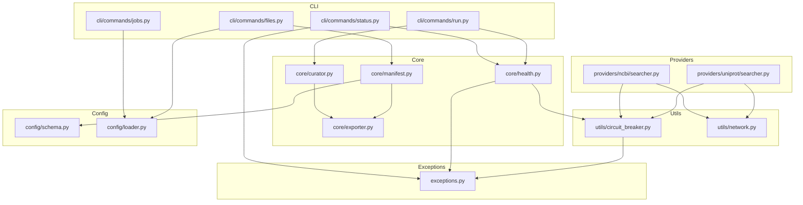

# Architecture Additions: Reliability, CLI, and Data Integrity

**Domain:** Reliable bioinformatics CLI for sequence curation
**Researched:** 2026-05-25
**Focus:** Circuit breaker, health checks, checksum verification, per-job manifests, CLI extensions
**Existing architecture:** Layered CLI→Config→Core→Providers→Utils with streaming ETL pipeline

---

## Current Architecture Summary

```
CLI (Typer+Rich) → Config (YAML/dataclasses) → Core (curator, filters, exporter)
  → Providers (NCBI via Biopython, UniProt via requests) → Utils (logging, retry)
```

**Key constraints for new components:**
- No changes to existing provider ABCs (`DatabaseSearcher[C]`, `QueryBuilder[T]`)
- Backwards-compatible YAML config format
- Streaming pipeline must remain generator-based (memory efficiency)
- New components must compose with existing `@retry` decorator

---

## 1. Circuit Breaker Integration

### Placement Decision: Utility Layer (`utils/circuit_breaker.py`)

**Rationale:** The circuit breaker is a cross-cutting reliability concern, like retry. It sits:

```
Core (curator) → Provider methods (search/fetch_metadata/download)
  → Circuit breaker (utils/circuit_breaker.py)        ← NEW
  → @retry (utils/network.py)                         ← EXISTING
  → Actual HTTP calls (requests / Bio.Entrez)
```

The circuit breaker wraps the **public provider methods**, while `@retry` wraps **specific internal network calls**. They are composable but operate at different levels:

```python
# NCBISearcher.search() — after applying circuit breaker
@circuit_breaker(provider_name="ncbi")
def search(self, criteria):
    # @retry is on _safe_entrez_call, not on search()
    try:
        result = self._safe_entrez_call(...)  # has @retry internally
        self._circuit_record_success("ncbi")
        return result
    except Exception as e:
        self._circuit_record_failure("ncbi")
        raise  # after RELIAB-01: propagate, don't swallow
```

### Circuit Breaker State Machine

```
         ┌──────────────────────────────┐
         │                              │
    ┌────▼────┐    failure_count >=     ┌───▼────┐
    │  CLOSED │────── threshold ──────► │  OPEN  │
    │ (normal)│                         │(fail   │
    └────┬────┘                         │  fast) │
         │                              └───┬────┘
         │ success resets                   │
         │ failure_count                    │ reset_timeout elapsed
         │                                  │
         │                           ┌──────▼──────┐
         │                           │  HALF_OPEN   │
         │◄────── success ───────────│ (probing)    │
         │                           └──────┬───────┘
         │                                  │
         │                           failure │(still down)
         │                                  │
         └──────────────────────────────────┘
```

### Protocol

```python
@dataclass
class CircuitState:
    provider_name: str
    state: Literal["closed", "open", "half_open"]
    failure_count: int
    last_failure_time: float | None
    opened_at: float | None

class CircuitBreaker:
    """Per-provider circuit breaker with thread-safe state."""
    _states: dict[str, CircuitState] = {}  # class-level: shared across instances

    @classmethod
    def get_state(cls, provider_name: str) -> CircuitState
    @classmethod
    def record_success(cls, provider_name: str)
    @classmethod
    def record_failure(cls, provider_name: str)
    @classmethod
    def reset(cls, provider_name: str)
```

### Decorator Interface

```python
# Usage on searcher public methods:
@circuit_breaker(
    provider_name="ncbi",
    failure_threshold=5,
    reset_timeout=60.0,
    half_open_max_calls=1,
)
def search(self, criteria): ...

# Or configured from DatabaseConfig:
@circuit_breaker(provider_name="ncbi")  # reads config from args[0].self.config
```

### Why Utility Layer (not Provider or Core)

| Layer | Reason against |
|-------|---------------|
| **Provider layer** | Would require modifying each searcher implementation. Violates DRY — same pattern duplicated across `NCBISearcher`, `UniProtSearcher`, and future providers. |
| **Core layer** | The curator orchestrates but doesn't make network calls. Circuit breaker belongs at the network boundary, not the orchestration layer. |
| **Utility layer** | Correct — analogous to `@retry`. Cross-cutting concern with no dependency on provider internals. Composable with other decorators. |

### Critical Dependency

The circuit breaker only works correctly **after** the silent error swallowing is fixed (RELIAB-01). Currently, searcher methods wrap everything in `except Exception: return []` — the circuit breaker decorator would never observe failures because exceptions are caught internally.

**Build order constraint:** Fix RELIAB-01 before or alongside circuit breaker implementation.

### State Sharing Across Biocurator Instance

Circuit breaker state is **class-level** (`CircuitBreaker._states` dict). This means:

- Multiple `Biocurator` instances share the same circuit state
- If one job run opens the circuit for NCBI, subsequent runs fail fast
- The CLI `status` command can report circuit state
- This is intentional: if NCBI is down, it's down for everyone

---

## 2. Health Check Subsystem

### Location: `core/health.py`

The health checker uses lightweight probes (not full searcher initialization) to test provider availability.

### Architecture

```
┌─────────────────────────────────────────────┐
│               HealthChecker                  │
│  core/health.py                              │
│                                              │
│  probe_ncbi() → ProviderStatus               │
│  probe_uniprot() → ProviderStatus            │
│  check_all() → HealthReport                  │
│  check_providers(names) → HealthReport       │
└──────────────────────┬──────────────────────┘
                       │ creates
         ┌─────────────┼─────────────┐
         ▼             ▼             ▼
    HTTP GET     esearch      CircuitBreaker
    (simple)     (simple)     .get_state()
```

### Probe Strategy

| Provider | Probe | What It Tests | Expected Response |
|----------|-------|--------------|-------------------|
| **NCBI** | `esearch(db="pubmed", term="*", retmax=1)` | Entrez API reachability + XML parsing | `<eSearchResult><Count>...</Count></eSearchResult>` |
| **UniProt** | `GET /uniprotkb/search?query=*&size=1` | REST API reachability + JSON parsing | 200 with `{"results": [...], "total": N}` |

### Data Model

```python
@dataclass
class ProviderStatus:
    name: str                                 # "ncbi", "uniprot"
    status: Literal["up", "degraded", "down"]
    latency_ms: float | None                  # None if unreachable
    error: str | None                          # Human-readable error if down
    circuit_state: Literal["closed", "open", "half_open"] | None
    last_checked: datetime

@dataclass
class HealthReport:
    providers: list[ProviderStatus]
    overall: Literal["up", "degraded", "down"]
    checked_at: datetime

    @property
    def all_up(self) -> bool:
        return all(p.status == "up" for p in self.providers)

    @property
    def any_down(self) -> bool:
        return any(p.status == "down" for p in self.providers)
```

### Integration Points

1. **CLI `status` command**: Creates `HealthChecker`, calls `check_all()`, renders Rich table
2. **Pre-flight before `run`**: Optional check — if enabled, runs `check_all()` before job execution
3. **Manifest enrichment**: Health report can be embedded in job manifest for traceability

### Probe Implementation Notes

- Use **short timeouts** (5s per probe) — health checks should be fast
- Probe failures should NOT trigger the circuit breaker (different concern — circuit breaker tracks production traffic failures)
- Circuit breaker state IS reported as part of the health status (e.g., "ncbi is up but circuit is open — recent failures detected")

---

## 3. Checksum Verification

### Where Checksums Are Computed: In `StreamingExporter`, at Write Time

**Rationale:** Incremental hashing (`hashlib.sha256().update()`) allows checksum computation without:
- Re-reading the file after writing
- Buffering the entire file in memory
- Adding a separate post-processing pass

### StreamingExporter Changes (Minimal)

```python
class StreamingExporter:
    def __init__(self, ...):
        ...
        self._hashers: dict[str, hashlib.sha256] = {}  # NEW: one per format
        self._record_counts: dict[str, int] = {}        # NEW: one per format

    def open(self):
        # Existing file creation, PLUS:
        self._hashers["fasta"] = hashlib.sha256()
        self._record_counts["fasta"] = 0

    def write_record(self, record):
        # Existing write logic, PLUS after each f.write():
        self._hashers["fasta"].update(written_bytes.encode())
        self._record_counts["fasta"] += 1

    def close(self):
        # Existing close logic, PLUS:
        self._checksums = {
            fmt: hasher.hexdigest()
            for fmt, hasher in self._hashers.items()
        }
        # (checksums available after close)

    def get_checksums(self) -> dict[str, str]:  # NEW
        """Return {format: sha256_hex} after close()."""
        return dict(getattr(self, '_checksums', {}))

    def get_record_counts(self) -> dict[str, int]:  # NEW
        """Return {format: record_count} after close()."""
        return dict(self._record_counts)
```

### Data Flow for Checksums

```
write_record(record)
  │
  ├──► Format-specific write (FASTA/CSV/JSON)
  │
  ├──► hasher.update(encoded_bytes)    ← per-file SHA-256
  │
  └──► record_counts[format] += 1      ← per-file counter

close()
  │
  ├──► Finalize JSON (write "]")
  ├──► Close file handles
  └──► Finalize hashers → _checksums[format] = hexdigest
```

### Verify Re-computation

The `--verify` flag on `biocurator files`:

```python
def verify_checksum(file_path: Path, expected_sha256: str) -> bool:
    """Re-compute SHA-256 of a file and compare to manifest checksum."""
    actual = hashlib.sha256(file_path.read_bytes()).hexdigest()
    return actual == expected_sha256
```

This catches both download-time corruption and storage bit-rot.

---

## 4. Per-Job Manifests

### Manifest Structure

```json
{
  "manifest_version": 1,
  "biocurator_version": "0.3.0",
  "job_name": "asfv",
  "created_at": "2026-05-25T12:00:00Z",
  "config": {
    "search": {
      "databases": ["ncbi", "uniprot"],
      "organism": "Asfarviridae",
      "keywords": ["ASFV", "African swine fever"],
      "max_results": 100
    },
    "filter": {
      "min_length": 100,
      "max_length": null,
      "quality_threshold": 0.8
    },
    "export": {
      "outdir": "results",
      "formats": ["fasta", "csv"],
      "prefix": "asfv_curated"
    }
  },
  "summary": {
    "search_results": 500,
    "metadata_fetched": 500,
    "filtered": 450,
    "quality_passed": 445,
    "exported": {
      "fasta": 445,
      "csv": 445
    }
  },
  "files": [
    {
      "path": "asfv_curated_sequences.fasta",
      "format": "fasta",
      "size_bytes": 284561,
      "checksum_sha256": "abc123def456...",
      "records": 445
    },
    {
      "path": "asfv_curated_metadata.csv",
      "format": "csv",
      "size_bytes": 89234,
      "checksum_sha256": "789012ghi345...",
      "records": 445
    }
  ],
  "providers": {
    "ncbi": {
      "status": "up",
      "circuit_state": "closed"
    },
    "uniprot": {
      "status": "up",
      "circuit_state": "closed"
    }
  }
}
```

### When Manifests Are Written: CLI Level, After `run_job()` Returns

**Not in `StreamingExporter`** (would mix streaming with post-processing).
**Not in `curator.run_job()`** (would couple the pipeline to manifest creation).

**Decision: CLI `run_command` assembles and writes the manifest.** The data flows:

```
run_command()
  │
  ├──► run_job() → JobResult {
  │     output_files, checksums, record_counts
  │   }
  │
  ├──► ManifestBuilder.build(
  │     job_config,
  │     output_files,
  │     checksums,
  │     record_counts,
  │     provider_health=None,        # optional
  │   )
  │
  ├──► manifest.write(outdir / "manifest.json")
  │
  └──► Return to user
```

### ManifestBuilder

```python
@dataclass
class FileManifestEntry:
    path: str
    format: str
    size_bytes: int
    checksum_sha256: str
    records: int

@dataclass
class JobManifest:
    manifest_version: int = 1
    biocurator_version: str
    job_name: str
    created_at: datetime
    config: dict                          # serialized JobConfig
    summary: dict                         # pipeline stats
    files: list[FileManifestEntry]
    providers: dict | None = None         # optional health snapshot

class ManifestBuilder:
    @staticmethod
    def build(
        job_config: JobConfig,
        output_files: dict[str, Path],
        checksums: dict[str, str],
        record_counts: dict[str, int],
        provider_health: HealthReport | None = None,
        pipeline_summary: dict | None = None,
    ) -> JobManifest: ...

    @staticmethod
    def write(manifest: JobManifest, outdir: Path) -> Path: ...

    @staticmethod
    def read(manifest_path: Path) -> JobManifest: ...

    @staticmethod
    def verify_files(
        manifest: JobManifest,
        base_dir: Path,
    ) -> dict[str, bool]:  # {file_path: checksum_match}
```

### Location: `core/manifest.py`

Depends on:
- `config.schema` (for `JobConfig` serialization)
- `biocurator.__version__`
- `json`, `pathlib` (stdlib)

---

## 5. CLI Command Structure

### Current: 3 commands

```
biocurator
├── init [--output, --template]
├── run CONFIG [--jobs, --dry-run, --verbose]
└── preview JOB_NAME [--config]
```

### New: 6 commands

```
biocurator
├── init [--output, --template]
├── run CONFIG [--jobs, --dry-run, --verbose, --check-health]
├── preview JOB_NAME [--config]
├── status [--config, --watch]
├── jobs CONFIG
└── files JOB_NAME [--config, --verify]
```

### New Command Details

#### `status` — Provider Health

```
biocurator status [OPTIONS]
  ├── -c, --config PATH    Config file (for provider config: API keys, timeouts)
  ├── -w, --watch          Continuously poll (every 5s, like `watch`)
  └── -o, --output TEXT    Output format: "table" (default) or "json"

Behavior:
  1. Creates HealthChecker
  2. Probes all registered providers (NCBI, UniProt)
  3. Reads circuit breaker state for each provider
  4. Renders Rich Table:

  ┌──────────┬────────┬──────────┬──────────────────────┐
  │ Provider │ Status │ Latency  │ Notes                │
  ├──────────┼────────┼──────────┼──────────────────────┤
  │ ncbi     │ ● up   │ 234ms    │ Circuit: closed      │
  │ uniprot  │ ● up   │ 156ms    │ Circuit: closed      │
  └──────────┴────────┴──────────┴──────────────────────┘
  Overall: ✓ All providers available
```

#### `jobs` — List Curation Jobs

```
biocurator jobs CONFIG [OPTIONS]
  ├── CONFIG               Path to YAML config (required positional)
  └── -v, --verbose        Show full filter/export details

Behavior:
  1. Loads config (reuses ConfigLoader)
  2. Renders Rich Table:

  ┌──────────┬───────────┬─────────────────┬────────────┐
  │ Job      │ Databases │ Search          │ Export     │
  ├──────────┼───────────┼─────────────────┼────────────┤
  │ asfv     │ ncbi      │ ASFV keywords   │ fasta, csv │
  │ covid    │ ncbi      │ SARS-CoV-2      │ fasta      │
  │ cyp450   │ uniprot   │ cytochrome P450 │ fasta, csv │
  └──────────┴───────────┴─────────────────┴────────────┘
```

#### `files` — List and Verify Output Files

```
biocurator files JOB_NAME [OPTIONS]
  ├── JOB_NAME             Job name (required positional — matches job.name in config)
  ├── -c, --config PATH    Path to YAML config (default: "config.yaml")
  └── --verify             Recompute checksums and compare with manifest

Behavior:
  1. Loads config, finds job by name
  2. Reads manifest.json from job's output directory
  3. Renders Rich Table:

  Without --verify:
  ┌──────────────────────────────────────┬────────┬────────┬────────┐
  │ File                                 │ Format │ Records│ Size   │
  ├──────────────────────────────────────┼────────┼────────┼────────┤
  │ results/asfv_curated_sequences.fasta │ fasta  │ 445    │ 278KB  │
  │ results/asfv_curated_metadata.csv    │ csv    │ 445    │ 87KB   │
  └──────────────────────────────────────┴────────┴────────┴────────┘
  SHA-256: abc123... (manifest)

  With --verify:
  ┌──────────────────────────────────────┬────────┬────────┬────────┬──────────────┐
  │ File                                 │ Format │ Records│ Size   │ Verify       │
  ├──────────────────────────────────────┼────────┼────────┼────────┼──────────────┤
  │ results/asfv_curated_sequences.fasta │ fasta  │ 445    │ 278KB  │ ✓ match     │
  │ results/asfv_curated_metadata.csv    │ csv    │ 87KB   │ 445    │ ✓ match     │
  └──────────────────────────────────────┴────────┴────────┴────────┴──────────────┘
```

### File Organization

```
src/biocurator/cli/commands/
├── __init__.py
├── init.py              # existing
├── run.py               # existing (modified: add --check-health)
├── preview.py           # existing
├── status.py            # NEW
├── jobs.py              # NEW
└── files.py             # NEW
```

Registration in `main.py`:

```python
from biocurator.cli.commands.status import status_command
from biocurator.cli.commands.jobs import jobs_command
from biocurator.cli.commands.files import files_command

app.command("status")(status_command)
app.command("jobs")(jobs_command)
app.command("files")(files_command)
```

---

## 6. Server Status Response Model

### Data Model Location: `core/health.py`

```python
from dataclasses import dataclass, field
from datetime import datetime
from typing import Literal


ProviderState = Literal["up", "degraded", "down"]
CircuitState = Literal["closed", "open", "half_open"]
OverallState = Literal["up", "degraded", "down"]


@dataclass
class ProviderProbeResult:
    """Result of a single provider probe."""
    provider_name: str
    reachable: bool
    status_code: int | None            # HTTP status if applicable
    latency_ms: float | None
    error_message: str | None
    detail: str | None                 # e.g., "Queried 'pubmed', found 42M records"


@dataclass
class ProviderHealth:
    """Combined health and circuit state for one provider.

    This is the user-facing status object returned by the health checker.
    """
    name: str
    status: ProviderState              # derived from probe_result + circuit_state
    latency_ms: float | None
    error: str | None
    circuit_state: CircuitState | None
    probe_result: ProviderProbeResult | None = None  # raw probe data
    last_checked: datetime = field(default_factory=datetime.now)


@dataclass
class HealthReport:
    """Aggregate health report for all providers."""
    providers: list[ProviderHealth]
    overall: OverallState
    checked_at: datetime = field(default_factory=datetime.now)

    @property
    def all_up(self) -> bool:
        return all(p.status == "up" for p in self.providers)

    @property
    def any_down(self) -> bool:
        return any(p.status == "down" for p in self.providers)

    @property
    def any_degraded(self) -> bool:
        return any(p.status == "degraded" for p in self.providers)

    def to_dict(self) -> dict:
        """Serializable form for CLI output."""
        return {
            "overall": self.overall,
            "checked_at": self.checked_at.isoformat(),
            "providers": [
                {
                    "name": p.name,
                    "status": p.status,
                    "latency_ms": p.latency_ms,
                    "error": p.error,
                    "circuit_state": p.circuit_state,
                }
                for p in self.providers
            ],
        }
```

### Status Derivation Rules

| Probe Reachable | Circuit State | Overall Status | When |
|----------------|--------------|----------------|------|
| ✓ Yes | closed | `up` | Normal operation |
| ✓ Yes | open | `degraded` | Provider responding but circuit open (recent failures) |
| ✓ Yes | half_open | `degraded` | Probing after outage |
| ✗ No | any | `down` | Provider unreachable |
| ✓ Yes, but slow (>3s) | closed | `degraded` | Latency warning |

---

## 7. Exception Hierarchy Additions

Add to `src/biocurator/exceptions.py`:

```python
class CircuitBreakerError(BiocuratorError):
    """Provider circuit breaker is open — failing fast without network call."""

class HealthCheckError(BiocuratorError):
    """Provider health check failed."""

class ManifestError(BiocuratorError):
    """Manifest file read/write/verify failed."""

class ChecksumMismatchError(BiocuratorError):
    """File checksum does not match manifest entry."""
```

---

## 8. Exception Handling Strategy for New Components

| Component | Error | Handling |
|-----------|-------|----------|
| **Circuit breaker** | Circuit open | Raise `CircuitBreakerError` immediately. CLI catches and displays: "⏸ NCBI is temporarily unavailable (circuit open). Retry in ~{reset_timeout}s." |
| **Health check** | Probe timeout | `ProviderProbeResult.reachable=False`, set status to `down`. Do NOT raise. |
| **Checksum generation** | Hash failure (rare) | Log warning, `None` checksum in manifest. Do not fail the export. |
| **Checksum verification** | Mismatch | Return `False` in verify dict. CLI displays red ❌. Optional `--strict` flag to raise `ChecksumMismatchError` and exit non-zero. |
| **Manifest read** | Missing/corrupt `manifest.json` | Raise `ManifestError` with descriptive message. CLI catches and displays error. |

---

## 9. New Module Directory

```
src/biocurator/
├── exceptions.py                    # MODIFIED: add 4 new exception types
├── cli/
│   └── commands/
│       ├── status.py                # NEW: biocurator status
│       ├── jobs.py                  # NEW: biocurator jobs
│       └── files.py                 # NEW: biocurator files
├── core/
│   ├── health.py                    # NEW: HealthChecker, ProviderHealth, HealthReport
│   └── manifest.py                  # NEW: ManifestBuilder, JobManifest, FileManifestEntry
├── utils/
│   └── circuit_breaker.py           # NEW: CircuitBreaker, circuit_breaker decorator, CircuitState
```

### Module Dependency Graph (new/changed modules)



---

## 10. Build Order and Phase Dependencies

### Dependency Graph

```
Phase 1A: Circuit breaker + exception types
  ↑ depends on: fixing RELIAB-01 (silent error swallowing)
  ↓ enables: health check, provider resilience

Phase 1B: Health check + CLI status command
  ↑ depends on: circuit breaker (for state reporting)
  ↓ enables: pre-flight checks, status visibility

Phase 2A: Checksum generation in exporter
  ↑ depends on: nothing (self-contained exporter change)
  ↓ enables: manifest file creation, verify

Phase 2B: Manifest system + CLI files/jobs commands
  ↑ depends on: checksum generation, config schema
  ↓ enables: data integrity verification

Phase 3: Integration + config schema
  ↑ depends on: all above
  └── pre-flight health check in `run`
  └── reliability config section in YAML
  └── retry config fields in DatabaseConfig
```

### Suggested Phase Sequence

| Phase | What | Components | Dependencies |
|-------|------|-----------|--------------|
| **1** | Fix silent error swallowing + Circuit breaker | `exceptions.py`, `utils/circuit_breaker.py`, modify `NCBISearcher`/`UniProtSearcher` | — (but must be first) |
| **2** | Health check + CLI status | `core/health.py`, `cli/commands/status.py` | Phase 1 (for circuit state) |
| **3** | Checksums + Exporter refinements | `core/exporter.py` (add hashing) | Phase 1 (exception types) |
| **4** | Manifest system + CLI jobs/files | `core/manifest.py`, `cli/commands/jobs.py`, `cli/commands/files.py` | Phase 3 (checksums) |
| **5** | Config schema + integration | `config/schema.py`, `config/loader.py`, modify `cli/commands/run.py`, modify `core/curator.py` | All above |

### What Can Be Parallelized

- Phases 2 (health check) and 3 (checksums) are **independent** — can be built in parallel
- Phases 4 and 5 depend on earlier phases — must be sequential
- Within Phase 4: CLI `jobs` (reads config only) and CLI `files` (reads manifest) are **independent** once manifest is designed

---

## 11. Integration with Existing Architecture — No Refactoring Required

### What Changes

| Component | Change Type | Nature |
|-----------|------------|--------|
| `utils/network.py` | None | `@retry` stays as-is |
| `providers/base.py` | Add fields to `DatabaseConfig` | Backwards-compatible (new fields have defaults) |
| `providers/ncbi/searcher.py` | Add `@circuit_breaker` decorator + fix error swallowing | Decorator addition; fix is bug fix, not refactor |
| `providers/uniprot/searcher.py` | Same as NCBI | Same |
| `core/exporter.py` | Add hashers + record counters | New internal state, no API changes |
| `core/curator.py` | Optional pre-flight health check | New method `check_health()`, not changing `run_job()` signature |
| `config/schema.py` | Add `RetryConfig`, `CircuitBreakerConfig`, optional `reliability` block | New fields with `None` defaults — existing configs unchanged |
| `cli/commands/run.py` | Add `--check-health` flag | New optional flag |

### What Does NOT Change

- `DatabaseSearcher[C]` ABC — no new abstract methods
- `SearchCriteria` — no new fields
- `SequenceRecord` — no new fields
- `StreamingExporter.__init__()` signature — unchanged
- `Biocurator.__init__()` — unchanged
- `CLI main.py callback` — unchanged
- YAML config format — new sections are optional

### Backwards Compatibility Guarantee

All existing config files and programmatic APIs continue to work. New features are opt-in:

- Circuit breaker: enabled by default with sensible thresholds (5 failures, 60s reset)
- Health check: use `--check-health` or configure in YAML
- Manifest: automatically written to output dir, existing workflows ignore it
- Checksums: automatically computed, no user action needed

---

## 12. Config Schema Evolution

### New `DatabaseConfig` Fields (backwards-compatible defaults)

```python
@dataclass
class DatabaseConfig:
    name: str
    base_url: str | None = None
    api_key: str | None = None
    rate_limit: float = 0.3
    batch_size: int = 20
    timeout: int = 30
    # NEW — retry configuration (moved from decorator defaults)
    retry_max_attempts: int = 3
    retry_initial_delay: float = 1.0
    retry_backoff_factor: float = 2.0
    retry_jitter: bool = True
    # NEW — circuit breaker configuration
    circuit_breaker_failure_threshold: int = 5
    circuit_breaker_reset_timeout: float = 60.0
    circuit_breaker_half_open_max: int = 1
```

### New Optional YAML Section

```yaml
# Optional reliability settings
reliability:
  health_check:
    enabled: true          # run pre-flight before job execution
    fail_fast: true        # abort job if provider is down
  circuit_breaker:
    global_failure_threshold: 5
    global_reset_timeout: 60
  
# Per-job overrides (search block)
search:
  databases:
    - ncbi
    - uniprot
  retry:
    max_attempts: 5        # per-job overrides per-provider default
    backoff_factor: 3.0
```

---

## 13. CLI Output Examples (Rich Rendering)

### `biocurator status`

```
╔══════════════════════════════════════════════════╗
║              Provider Status                     ║
╠══════════════════════════════════════════════════╣
║                                                  ║
║  ncbi    ● UP      234ms   Circuit: closed       ║
║  uniprot ● UP      156ms   Circuit: closed       ║
║                                                  ║
║  Overall: ✓ All providers available              ║
╚══════════════════════════════════════════════════╝
```

### `biocurator files --verify` (mismatch)

```
╔══════════════════════════════════════════════════════════════╗
║                    Job: asfv — Files                        ║
╠══════════════════════════════════════════════════════════════╣
║                                                              ║
║  File                            Format   Records   Verify   ║
║  ─────────────────────────────────────────────────────────── ║
║  results/asfv_sequences.fasta    fasta    445       ✓       ║
║  results/asfv_metadata.csv       csv      445       ✗       ║
║                                                              ║
║  Manifest: results/manifest.json  (2026-05-25 12:00:00)     ║
║                                                              ║
║  ⚠ 1 file failed checksum verification                       ║
╚══════════════════════════════════════════════════════════════╝
```

---

## 14. Risk Assessment

| Risk | Component | Mitigation |
|------|-----------|------------|
| Circuit breaker never triggers because errors are swallowed | All providers | MUST fix RELIAB-01 before or in same phase as circuit breaker |
| Manifest grows unbounded for large jobs | Manifest | Only store checksums + counts, not sequence data. File size always < 10KB. |
| Checksum computation slows streaming writes | Exporter | `hashlib.sha256().update()` is ~1GB/s in Python — negligible for typical sequence files (<100MB). |
| Health probe hits rate limits | Health checker | Use minimal queries (`retmax=1`), respect `rate_limit` config. |
| CLI `status --watch` overwhelms API | Health checker | Default 5s interval between probes. Rate-limit aware (respects provider config). |

---

## 15. Testing Strategy

| Component | Test Approach | Key Scenarios |
|-----------|--------------|---------------|
| **Circuit breaker** | Unit test state machine in isolation | Closed→open on threshold, open→half_open after timeout, half_open→closed on success, half_open→open on failure |
| **Circuit breaker decorator** | Unit test with mock searcher | Decorator correctly wraps, failure counting, state inspection |
| **Health checker** | Unit test with mock HTTP responses | Up (200), down (connection error), degraded (slow >3s), partial failure |
| **StreamingExporter hashing** | Unit test with known records | Hash matches `hashlib.file_digest()` of written file, record count correct |
| **ManifestBuilder** | Unit test round-trip | Build → write → read → verify, all fields preserved |
| **CLI commands** | Click/Typer runner test | `status` renders table, `files --verify` reports match/mismatch |
| **Integration** | Full pipeline with mock providers | Health check → circuit breaker → run → manifest → verify files → mismatch detection |

---

## Sources

- Current codebase analysis: `.planning/codebase/ARCHITECTURE.md`, `.planning/codebase/STRUCTURE.md`, `.planning/codebase/CONCERNS.md`
- Project requirements: `.planning/PROJECT.md`
- Michael T. Nygard, *Release It!* — circuit breaker pattern reference
- Microsoft Azure patterns: [Circuit Breaker pattern](https://learn.microsoft.com/en-us/azure/architecture/patterns/circuit-breaker)
- Python `hashlib` docs: incremental hashing via `.update()`
- Typer docs: adding commands to existing app via `app.command()`
