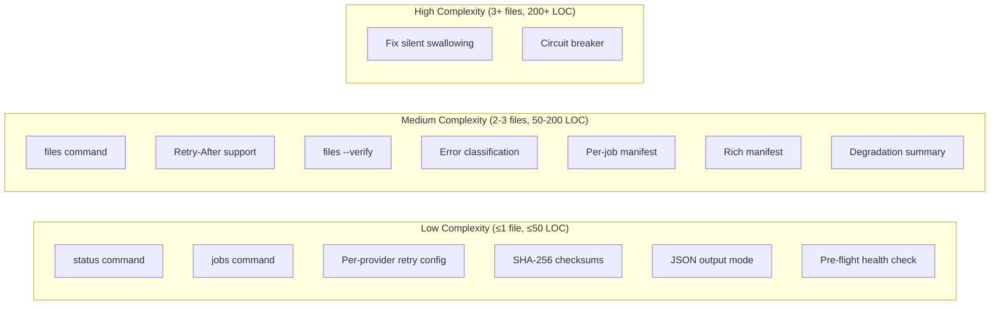

# Feature Landscape: Biocurator Reliability & CLI Extensions

**Domain:** Config-driven bioinformatics CLI for sequence curation from NCBI/UniProt
**Researched:** 2026-05-25
**Milestone focus:** Reliability (circuit breakers, retry, error handling), CLI usability (status, jobs, files), Data integrity (checksums, manifests)

---

## Existing Features (Already Built — v0.2.0)

These features exist in the current codebase and form the foundation this milestone builds on:

| Feature | Location | Notes |
|---------|----------|-------|
| Config-driven YAML pipeline | `config/schema.py`, `loader.py` | Typed dataclass schema, validated at load |
| NCBI Entrez provider | `providers/ncbi/` | `esearch` with history, `esummary`, `efetch` |
| UniProt REST API provider | `providers/uniprot/` | `/uniprotkb/search`, `/accessions`, FASTA download |
| Streaming export (FASTA/CSV/JSON) | `core/exporter.py` | Generator-based, memory-efficient |
| CLI with Typer + Rich | `cli/main.py` + `run.py`, `preview.py`, `init.py` | Progress bars, tables |
| Exponential backoff retry decorator | `utils/network.py` | Generic `@retry` decorator (3 attempts, 2x backoff) |
| Sequence filtering | `core/filters.py` | Length, organism, exclude terms, quality threshold |
| Typed exception hierarchy | `exceptions.py` | 7 subtypes: `ConfigNotFound`, `InvalidConfig`, `JobNotFound`, `DatabaseSearchError`, `DownloadError`, `ExportError` |
| Rate limiting | `providers/base.py` (`DatabaseConfig.rate_limit`) | Per-provider delay between requests |
| Provider registry | `providers/registry.py` | Plugin-style static registry |
| CI via GitHub Actions | `.github/` | Tests on push/PR, publish on release |

---

## Table Stakes

Features users expect in any reliable CLI tool for API-driven data retrieval. Missing these = tool feels incomplete or untrustworthy.

| # | Feature | Why Expected | Complexity | Dependencies | Priority |
|---|---------|-------------|------------|--------------|----------|
| TS-01 | **`status` command** — probe NCBI/UniProt API availability | Every CLI tool that talks to remote APIs needs a health check (EDirect `einfo`, sra-tools `vdb-config`, QuickETL `info --check`, oxo-flow `status`). Users need to know "is the server up?" before running a long job. | Low | None — independent command | **P0** |
| TS-02 | **`jobs [config.yaml]` command** — list available jobs with descriptions | Standard for config-driven ETL tools (etlplus `check --jobs`, feather `status --json`, hale-bopp-etl `list`, QuickETL `validate`). Users need to inspect what a config will run before executing. | Low | Config loader (exists) | **P0** |
| TS-03 | **`files [job_name]` command** — list downloaded files per job with metadata | Users need to know what files were produced, where they are, and basic metadata (count, formats, timestamps). Mirrors etlplus `history`, feather `status --table`. | Medium | Requires manifest files (DI-02) | **P1** |
| TS-04 | **Eliminate silent error swallowing** — exceptions propagate clearly instead of returning empty results | The #1 reliability gap identified in PROJECT.md. Current searchers catch all exceptions and `return []` / `logger.warning` — user gets empty output with no signal that something went wrong. Entrez Direct surfaces errors; silent failure is unacceptable. | High | None — pure bugfix | **P0** |
| TS-05 | **Per-provider configurable retry** — max_attempts, backoff_factor, timeout per provider in config | Current `@retry` decorator defaults (3 attempts, 1s initial, 2x backoff) are hardcoded. NCBI and UniProt have different reliability profiles. EDirect auto-retries; modern retry patterns (urllib3.Retry, tenacity) all support configurable params. | Low | None — extends existing `DatabaseConfig` | **P1** |
| TS-06 | **Retry-After header support** — honor `Retry-After` from 429/503 responses | Standard for HTTP API clients (urllib3 supports it natively, tenacity can be configured). Essential for respecting upstream rate limit signals. | Medium | None — extends `UniProtSearcher` HTTP handling | **P2** |
| TS-07 | **SHA-256 checksums on all downloaded files** — computed during export | Standard for bioinformatics data tools (NCBI Datasets has built-in validation, genomebundle `manifest.json` includes SHA256, sra-tools `prefetch --verify`, SMaHT portal includes md5sum in manifests). Users need to know their downloaded data is intact. | Low | Exporter already opens file handles | **P1** |
| TS-08 | **`files --verify`** — verify stored checksums against current files to detect corruption | Expected by users who care about data integrity. NCBI Datasets supports `md5sum -c md5sum.txt`, genomebundle has `verify` subcommand. sra-tools has `vdb-validate` (but with known gaps for small files — still expected). | Medium | Requires manifest files (DI-02) | **P1** |
| TS-09 | **Error classification** — separate transient (network timeout, 5xx) from permanent (4xx auth, 404) errors | Modern retry patterns all distinguish these (self-healing pipelines, Stroma, urllib3 Retry). Retrying a 401 is wasteful; retrying a 503 is productive. Current `@retry` catches all `Exception` indiscriminately. | Medium | None — extends `utils/network.py` | **P2** |
| TS-10 | **JSON output mode (`--json`)** on status/jobs/files commands for script consumption | CLI tools consumed by scripts/LLMs need machine-readable output. Feather ETL has `--json` on all commands, etlplus has `--event-format jsonl`. Essential for composability. | Low | None — Rich rendering with option | **P2** |

---

## Differentiators

Features that set biocurator apart from comparable tools. Not essential but provide clear value.

| # | Feature | Value Proposition | Complexity | Dependencies | Priority |
|---|---------|-------------------|------------|--------------|----------|
| DF-01 | **Circuit breaker pattern** — prevent cascading failures when server is down | Beyond standard retry. When NCBI/UniProt is down, repeated retries hammer the server and waste time. Circuit breaker fails fast after N consecutive failures, periodically probes for recovery. Rare in bioinformatics CLI tools (not in EDirect, sra-tools, datasets CLI). Common in modern API clients (requests adapters, PyBreaker). | **High** | Requires error classification (TS-09) + per-provider state | **P1** |
| DF-02 | **Pre-flight health check before job execution** — optional `--health-check` flag on `run` | Probes server availability before starting a long job. Saves user time if server is down. Not commonly seen in bioinformatics CLI tools (EDirect doesn't do this — it tries and fails). | Low | Requires `status` command (TS-01) | **P2** |
| DF-03 | **Rich per-job manifest** — JSON manifest with job metadata + checksums + run stats | Beyond just SHA256. Includes: job name, provider, search criteria used, timestamps, total records, output file listing, source URLs. genomebundle does manifest files, but most simple CLI tools don't include this level of job provenance. | Medium | Requires checksum generation (DI-01) | **P1** |
| DF-04 | **`biocurator files --status`** — color-coded file health (OK / CORRUPT / MISSING) | Goes beyond simple verify. Shows aggregated health dashboard for all outputs. Not seen in comparable tools. | Medium | Requires `--verify` (TS-08) + files command (TS-03) | **P3** |
| DF-05 | **Graceful degradation on partial failure** — some records fail but job continues + clear error summary | Current behavior (log warning + continue) is good, but no summary at end. Differentiator: at job completion, show a clear failure summary table: "X of Y records failed. See log for details." | Low | Requires TS-04 (error propagation fix) | **P2** |
| DF-06 | **`jobs --graph`** — show job dependency/execution order | Mirroring etlplus `check --graph`, oxo-flow `graph`. Currently jobs run in config order (independent), but future-proofing with DAG visualization is a differentiator. | Low | Requires jobs command (TS-02) | **P3** |

---

## Anti-Features

Features explicitly NOT to build. Rationale and what to do instead.

| Anti-Feature | Why Avoid | What to Do Instead |
|-------------|-----------|-------------------|
| **Auto-resume partial downloads** | sra-tools `prefetch` supports this, but our streaming model fetches sequences one-at-a-time through generators. Resume logic would require stateful tracking of individual records + partial file reconstruction. Enormous complexity for rare benefit. | Re-run the job. If retry + circuit breaker are in place, a re-run is fast and catches any transient issues. |
| **Parallel/multi-threaded downloads** | NCBI Entrez explicitly discourages multi-process access ("do not run from multiple processors on a compute farm"). UniProt REST API has rate limits. Parallelism introduces rate-limit issues and adds thread-safety complexity to the streaming exporter. | Keep sequential streaming. Scale via config (`max_results`). |
| **GUI or web interface** | Already declared out of scope in PROJECT.md. CLI-only tool. Preserves Unix pipeline composability. | Use `--json` output for tool/script integration. |
| **Docker containerization** | Already out of scope. Local CLI tool only. | Use pip/uv install. |
| **New database providers** | Out of scope. Expanding providers is a future milestone concern. | None — not part of this milestone. |
| **Interactive job scheduling / cron** | Would require persistent daemon, database of schedules, PID management. Complete scope creep. | Users can use system cron or task scheduler + `biocurator run`. |
| **Hardware resource estimation** | oxo-flow has this, but biocurator's memory footprint is predictable (streaming ≈ 1 record in memory). Unnecessary complexity. | Document expected resource usage in CLI help text. |
| **S3/cloud storage integration** | Bioinformatics tools increasingly support cloud (sra-tools has cloud-native operation), but biocurator is a workstation tool. Cloud adds auth complexity, retry differences, etc. | Keep local filesystem. Use standard cloud sync tools (aws s3 sync, rclone) on the output directory. |
| **Progress persistence** (logging every 10 records survives crash for resume) | Adds write-to-disk on every progress update. IO overhead for marginal benefit. Re-running is simpler and fast. | Keep in-memory progress callbacks for the progress bar. |
| **MD5 in addition to SHA-256** | MD5 is faster but collision-vulnerable. NCBI Datasets uses MD5 for their checksum files (historical). For a modern tool, SHA-256 is the right choice. | Use SHA-256 only. No need to support both. |

---

## Feature Dependencies

```
TS-04 (Fix silent swallowing) ──→ All reliability features depend on errors propagating
                                  correctly to even be testable

TS-09 (Error classification) ────→ DF-01 (Circuit breaker needs to know what's a transient error)
                                → TS-06 (Retry-After == transient)

TS-01 (status command) ─────────→ DF-02 (Pre-flight check wraps status endpoint)

DI-01 (SHA-256 on export) ──────→ DI-02 (Per-job manifest stores checksums)
DI-02 (Per-job manifest) ───────→ TS-03 (files command reads manifest)
                                → TS-08 (files --verify reads manifest checksums)
                                → DF-03 (Rich manifest is an enhancement of DI-02)

TS-02 (jobs command) ───────────→ DF-06 (jobs --graph extends jobs command)

TS-03 (files command) ──────────→ DF-04 (files --status extends files command)
```

### Dependency Graph (topological order for planning)

```
Layer 0 (Foundational — do first):
  TS-04 (Fix silent swallowing) — no deps, pure bugfix
  TS-01 (status command) — independent
  TS-05 (Per-provider retry config) — extends existing, no deps

Layer 1 (Build on Layer 0):
  TS-09 (Error classification) — requires TS-04
  TS-06 (Retry-After header support) — independent, HTTP-layer change
  DI-01 (SHA-256 checksums) — extends exporter

Layer 2 (Orchestration):
  DI-02 (Per-job manifest) — requires DI-01
  DF-01 (Circuit breaker) — requires TS-09, TS-05
  TS-02 (jobs command) — requires config loader (exists)
  DF-02 (Pre-flight check) — requires TS-01

Layer 3 (User-facing):
  TS-03 (files command) — requires DI-02
  TS-08 (files --verify) — requires DI-02
  TS-10 (--json mode) — depends on TS-01/TS-02/TS-03
  DF-03 (Rich manifest) — enhances DI-02
  DF-05 (Graceful degradation summary) — requires TS-04

Layer 4 (Polish):
  DF-04 (files --status) — requires TS-03, TS-08
  DF-06 (jobs --graph) — requires TS-02
```

---

## Complexity Assessment



---

## Design Decisions & Trade-offs

### Checksum Strategy: SHA-256 over MD5
- **Decision:** SHA-256 only
- **Rationale:** NCBI Datasets uses MD5 (historical), but MD5 is collision-vulnerable (AWS HealthOmics explicitly warns "MD5 hashing is known to be vulnerable to collisions"). SHA-256 is the modern standard.
- **Cost:** ~30% slower than MD5 on large files, negligible for sequence text files

### Manifest Format: JSON over YAML/Toml/CSV
- **Decision:** JSON (`manifest.json` per job)
- **Rationale:** Machine-readable, schema-flexible, widely parseable. genomebundle uses `manifest.json`. NCBI Datasets uses `dataset_catalog.json`. JSON is the de facto standard for data provenance manifests.
- **Structure:**
  ```json
  {
    "job_name": "...",
    "job_config": { /* snapshot of config used */ },
    "created_at": "2026-05-25T10:30:00Z",
    "checksums": {
      "filename.fasta": {
        "sha256": "abc...",
        "size": 12345,
        "status": "ok"
      }
    },
    "stats": {
      "total_searched": 500,
      "total_downloaded": 342,
      "total_exported": 298,
      "failures": []
    }
  }
  ```

### Circuit Breaker: Lightweight over Library
- **Decision:** Custom lightweight state machine (≈80 LOC) over PyBreaker or similar
- **Rationale:** Circuit breaker for an API client is simple — closed → open → half-open state machine with failure count + recovery timeout. PyBreaker adds dependencies for minimal benefit. Pattern from Ines Panker's adapter-level breaker is proven and compact.
- **Integration point:** Mount as HTTP adapter for UniProt (requests Session), wrap Entrez calls for NCBI

### `status` Command: Active Probe over Passive
- **Decision:** Actively probe a known endpoint (e.g., `einfo` for NCBI, `/uniprotkb/statistics` for UniProt) rather than checking cached state
- **Rationale:** Passive state (e.g., "last known good") is stale. An active probe at invocation time tells the user the current state. EDirect `einfo` returns status; sra-tools `vdb-config -i` checks remote access. Active is standard.

### `files` Command: Manifest-Driven over Filesystem Scan
- **Decision:** Read from per-job manifest files, with fallback to filesystem scan
- **Rationale:** Manifests contain metadata (checksums, timestamps, source URLs) that filesystem scan cannot provide. But if manifest is missing, a filesystem scan (glob for `*_sequences.fasta`, etc.) gives a useful fallback.

### `jobs` Command: Config-Parsed over Registry-Sourced
- **Decision:** Parse the YAML config and extract job metadata (name, databases, filters, export format, description if present)
- **Rationale:** Config file is the source of truth. Jobs are defined in YAML, not registered programmatically. Mirroring etlplus `check --jobs` which reads the pipeline YAML.

---

## Feature Comparison with Similar Tools

| Feature | EDirect | sra-tools | NCBI Datasets CLI | genomebundle | etlplus/feather | **biocurator (planned)** |
|---------|---------|-----------|-------------------|--------------|-----------------|--------------------------|
| Health/status probe | `einfo` | `vdb-config -i` | ✗ | ✗ | `info --check` | `status` |
| List jobs | ✗ | ✗ | ✗ | ✗ | `check --jobs` | `jobs [config]` |
| List output files | ✗ | `vdb-dump --info`¹ | ✗ | `show` | `history --table` | `files [job]` |
| Retry with backoff | Built-in | Built-in | Built-in | ✗ | ✗ (relies on env) | Configurable per-provider |
| Circuit breaker | ✗ | ✗ | ✗ | ✗ | ✗ | **Planned** (differentiator) |
| SHA-256 checksums | ✗ | ✗ | MD5 only² | SHA256 | ✗ | **Planned** (SHA256) |
| Checksum verify | ✗ | `vdb-validate`³ | `md5sum -c` | `verify` | ✗ | `files --verify` |
| Manifest file | ✗ | ✗ | `dataset_catalog.json` | `manifest.json` | ✗ | **Planned** (JSON) |
| Pre-flight check | ✗ | ✗ | ✗ | ✗ | ✗ | **Planned** (differentiator) |
| Error classification | Partial | ✗ | ✗ | ✗ | ✗ | **Planned** |
| --json output | ✗ | ✗ | ✗ | ✗ | `feather --json` | **Planned** |
| Silent error handling | Exceptions surface | Error messages | Errors surface | Errors surface | Errors surface | **Must fix** |

¹ `vdb-dump --info` shows file sizes, not a listing command
² NCBI Datasets CLI v16+ uses MD5; SHA256 not supported
³ `vdb-validate` has known gaps — doesn't detect corruption in small files (issue #896)

---

## MVP Recommendation for This Milestone

### Phase 1: Reliability Foundation (Layer 0)
1. **TS-04** Fix silent error swallowing — the highest-impact change, everything else depends on errors propagating correctly
2. **TS-05** Per-provider configurable retry (add fields to `DatabaseConfig`, wire through `@retry`)
3. **TS-01** `status` command — simplest new command, independent, gives immediate UX win

### Phase 2: Data Integrity (Layer 1-2)
4. **DI-01** SHA-256 checksums during export (in `StreamingExporter.write_record()` or at close)
5. **DI-02** Per-job manifest files (JSON metadata + checksums written alongside output files)
6. **TS-02** `jobs [config.yaml]` — reads config, lists jobs with descriptions

### Phase 3: Advanced Reliability (Layer 2-3)
7. **TS-09** Error classification (transient vs permanent)
8. **DF-01** Circuit breaker pattern (requires TS-09)
9. **TS-03** `files [job_name]` — reads manifests, lists files
10. **TS-08** `files --verify` — checksums against current files

### Phase 4: Polish (Layer 3-4)
11. **TS-10** `--json` mode on all list/status commands
12. **DF-05** Graceful degradation summary at job end
13. **DF-03** Rich manifest enhancements (source URLs, run provenance)
14. **DF-04** `files --status` color-coded health
15. **TS-06** Retry-After header support
16. **DF-02** `run --health-check` flag

### Deferred (Not in this milestone)
- DF-06 `jobs --graph` — no dependencies between jobs yet
- Parallel downloads — conflicts with API terms
- Auto-resume — streaming model makes this impractical

---

## Sources

- **EDirect documentation** — NCBI Bookshelf (https://www.ncbi.nlm.nih.gov/books/NBK179288/). Built-in retry, rate limiting, `einfo` for status. [HIGH confidence]
- **EDirect Release Notes** — Version 25.2 (March 2026). Added retry+verify steps, `edirect.py` Python module, `EDIRECT_NO_RETRY` env var. [HIGH confidence]
- **sra-tools Wiki** — `prefetch` + `fasterq-dump` flow, `vdb-validate` for verification, `prefetch --verify`. [HIGH confidence]
- **sra-tools Issue #896** — `vdb-validate` corruption detection gaps (small files), enhanced in 3.2.0 with "checksums missing" warning. [HIGH confidence]
- **NCBI Datasets CLI** — Built-in validation after download, MD5 checksum file (`md5sum.txt`), `--fast-zip-validation` flag. [HIGH confidence]
- **genomebundle** — SHA256 checksums in `manifest.json`, `verify` command, `show` command. [MEDIUM confidence — single source]
- **Self-healing data pipelines** — Circuit breaker, error classification, checkpointing patterns (Fawad Hussain Syed, 2026). [MEDIUM confidence — blog post, common patterns]
- **Circuit breaker in Python requests** — HTTP adapter-level breaker with urllib3.Retry interaction (Ines Panker, 2026). [MEDIUM confidence — blog post, proven pattern]
- **etlplus** — `check --jobs`, `check --summary`, `history`, `status` commands for config-driven ETL. [HIGH confidence — documented source]
- **feather ETL** — `status`, `history`, `validate`, `discover`, `--json` output on all commands. [HIGH confidence — documented PRD]
- **oxo-flow** — 18 CLI subcommands, `status`, `validate`, `lint`, `graph`, `env check`. [MEDIUM confidence — single source]
- **QuickETL** — `info --check --backends`, `validate`, `schema` commands. [MEDIUM confidence — documentation page]
- **Python retry best practices** — urllib3.Retry config for 429/5xx, backoff_factor formula, jitter, respect Retry-After. [HIGH confidence — multiple sources converge]
- **NCBI Entrez Best Practices** — Do not run from multiple processors, keep <50K expected hits, update to latest version. [HIGH confidence — EDirect Cookbook]

---

*Prepared for milestone phase planning. See also: [PITFALLS.md](./PITFALLS.md) for risks associated with these features, [STACK.md](./STACK.md) for technology decisions.*
